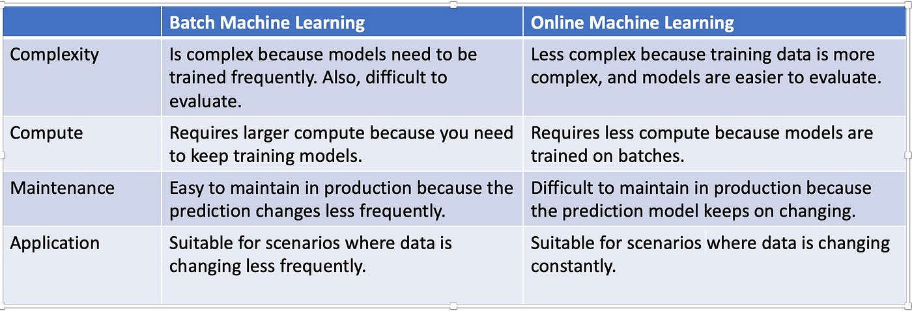
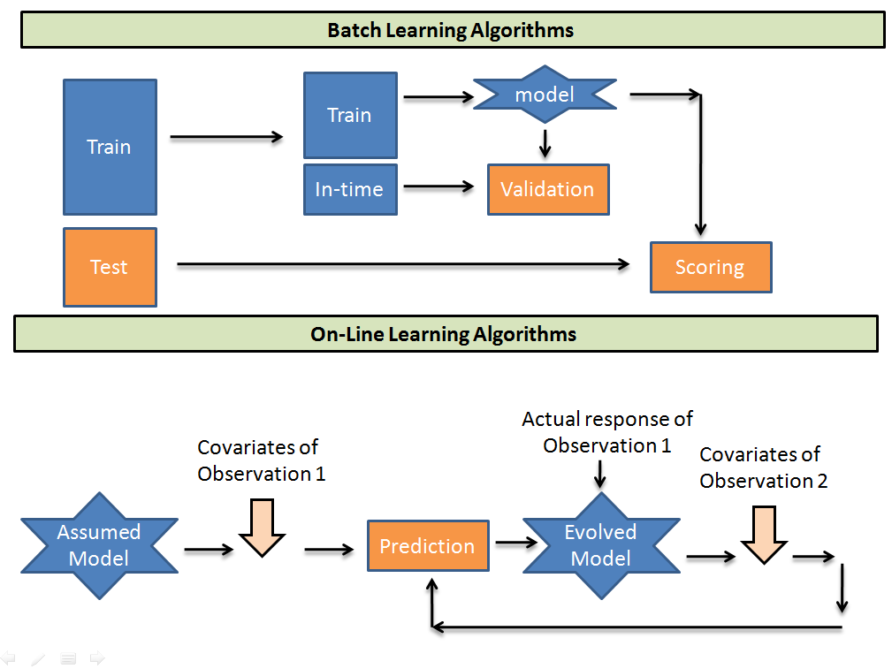

# Machine Learning from
1. Batch Learning
2. Online Learning

###
## 1. Batch Learning
In machine learning, "batch learning" refers to training a model on the entire dataset at once. 

## 2. Online Learning
 while "online learning" involves updating the model incrementally as new data arrives, allowing for continuous learning from a stream of data in real-time.

 ###
 Especially, batch learning is a static approach, while online learning is dynamic and adaptable to changing data conditions. 

## Key Differences:
### Data Processing:
Batch learning processes all data at once, whereas online learning processes data one sample at a time or in small batches. 

### Model Update:
In batch learning, the model is updated after processing the entire dataset, while in online learning, the model is updated continuously as new data becomes available. 

### Best Use Cases:
Batch learning is suitable for situations with static, large datasets where high accuracy is prioritized, while online learning is ideal for real-time applications where data is constantly streaming and adaptability is crucial

## Advantages of Batch Learning: 
- Higher Accuracy: Can often achieve higher accuracy due to thorough processing of the entire dataset. 
 - Optimized Training: Allows for more optimization techniques to be applied during training. 
- Suitable for Static Data: Well-suited for datasets that are not expected to change significantly. 

## Disadvantages of Batch Learning:
- Computational Cost: Requires more computational resources to process large datasets at once. 
- Slow Adaptation: Cannot adapt to new data quickly as it needs to retrain on the entire dataset. 

## Advantages of Online Learning:
- Real-time Adaptation: Can continuously update the model as new data arrives, making it ideal for dynamic environments. 
- Scalability: Can handle large streams of data without needing to store the entire dataset. 
- Lower Computational Overhead: Typically requires less upfront computational power compared to batch learning. 

## Disadvantages of Online Learning:
- Potential Accuracy Issues: May be less accurate than batch learning if data quality is inconsistent or noisy. 
- Sensitivity to Data Drift: Can be easily affected by changes in data distribution over time. 

