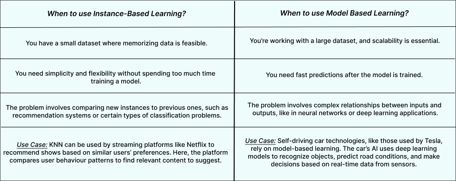

# Day 006- How ML learn

## Two ways they learn
1. Instance based learning
2. Model Based learning

###
## 1 Instance based learning
In machine learning, "instance-based learning" refers to a method where predictions are made by directly comparing new data points to stored training examples (instances), essentially "memorizing" the data.

## 2. Model Based learning
While "model-based learning" involves building a mathematical model that captures underlying patterns in the data to make predictions, allowing for better generalization to unseen data. 

## Example of Instance-based Learning:
- **K-Nearest Neighbors (KNN):** This algorithm classifies new data points by finding the closest K training examples and assigning the new data point the majority class of those neighbors. 
## Example of Model-Based Learning:
- **Linear Regression:** This model learns a linear relationship between input and output variables, allowing predictions based on a mathematical equation. 

