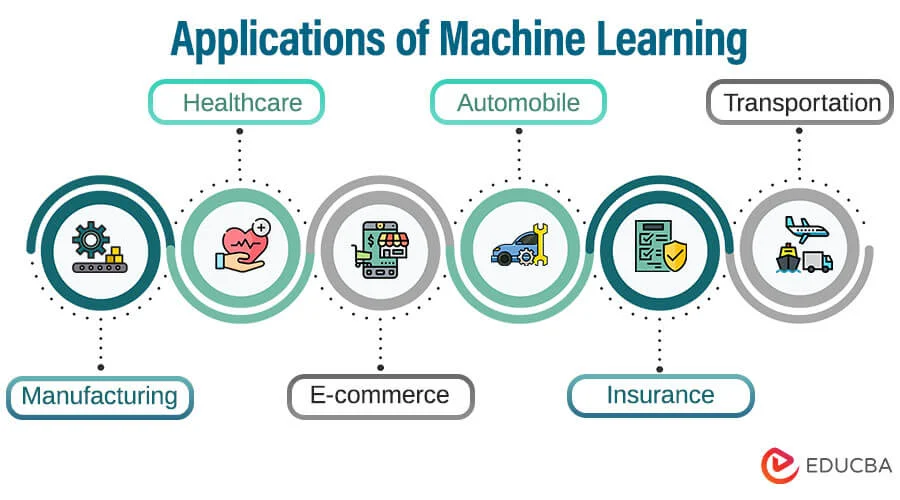

# Day 008 - Application of ML

**Eti-Kotha:** If you never pray for product then you're product.

## Some Application Field

### 1. Image Recognition:
Image recognition is one of the most common applications of machine learning. It is used to identify objects, persons, places, digital images, etc. The popular use case of image recognition and face detection is, Automatic friend tagging suggestion:

### 2. Speech Recognition
While using Google, we get an option of "Search by voice," it comes under speech recognition, and it's a popular application of machine learning.

### 3. Traffic prediction:
If we want to visit a new place, we take help of Google Maps, which shows us the correct path with the shortest route and predicts the traffic conditions.

### 4. Product recommendations:
Machine learning is widely used by various e-commerce and entertainment companies such as Amazon, Netflix, etc., for product recommendation to the user. Whenever we search for some product on Amazon, then we started getting an advertisement for the same product while internet surfing on the same browser and this is because of machine learning.

### 5. Self-driving cars:
One of the most exciting applications of machine learning is self-driving cars. Machine learning plays a significant role in self-driving cars. Tesla, the most popular car manufacturing company is working on self-driving car. It is using unsupervised learning method to train the car models to detect people and objects while driving.

### 6. Email Spam and Malware Filtering:
Whenever we receive a new email, it is filtered automatically as important, normal, and spam. We always receive an important mail in our inbox with the important symbol and spam emails in our spam box, and the technology behind this is Machine learning. Below are some spam filters used by Gmail:

- Content Filter
- Header filter
- General blacklists filter
- Rules-based filters
- Permission filters

### 7. Virtual Personal Assistant:
We have various virtual personal assistants such as Google assistant, Alexa, Cortana, Siri. As the name suggests, they help us in finding the information using our voice instruction. These assistants can help us in various ways just by our voice instructions such as Play music, call someone, Open an email, Scheduling an appointment, etc.

### 8. Online Fraud Detection:
Machine learning is making our online transaction safe and secure by detecting fraud transaction. Whenever we perform some online transaction, there may be various ways that a fraudulent transaction can take place such as fake accounts, fake ids, and steal money in the middle of a transaction. So to detect this, Feed Forward Neural network helps us by checking whether it is a genuine transaction or a fraud transaction.

### 9. Stock Market trading:
Machine learning is widely used in stock market trading. In the stock market, there is always a risk of up and downs in shares, so for this machine learning's long short term memory neural network is used for the prediction of stock market trends.

### 10. Medical Diagnosis:
In medical science, machine learning is used for diseases diagnoses. With this, medical technology is growing very fast and able to build 3D models that can predict the exact position of lesions in the brain.

### 11. Automatic Language Translation:
Nowadays, if we visit a new place and we are not aware of the language then it is not a problem at all, as for this also machine learning helps us by converting the text into our known languages. Google's GNMT (Google Neural Machine Translation) provide this feature, which is a Neural Machine Learning that translates the text into our familiar language, and it called as automatic translation.

