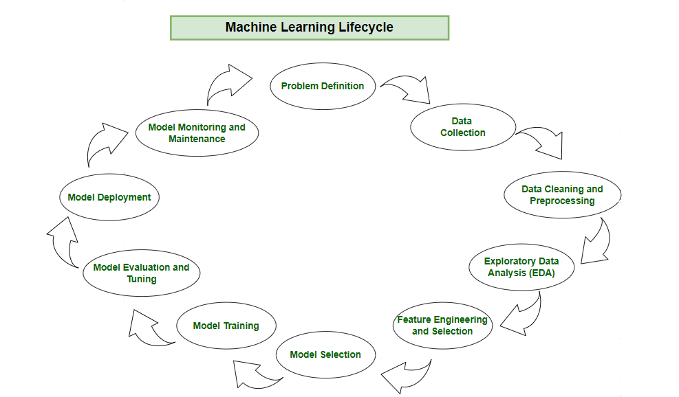

# Day_009 - ML Deployment Life Cycle
Machine learning lifecycle is a process that guides development and deployment of machine learning models in a structured way. It consists of various steps. Each step plays a crucial role in ensuring the success and effectiveness of the machine learning model. By following the machine learning lifecycle we can solve complex problems, can get data-driven insights and create scalable and sustainable models. The steps are:

```
1. Frame the Problem
2. Gathering Data
3. Data Pre-Processing
4. EDA
5. Features Engineering and Selection
6. Model Training, Evaluation and selection
7. Model Deployment
8. Testing
9. Optimize
```

