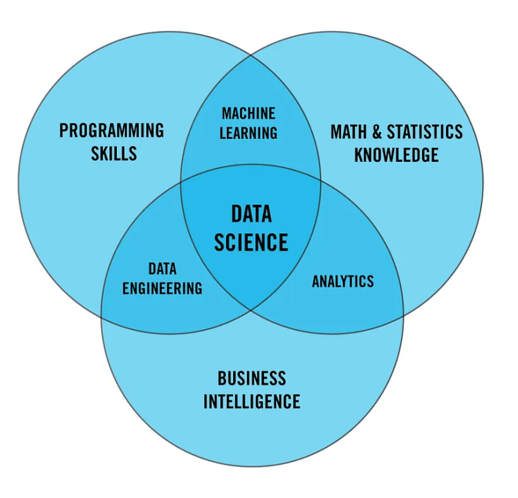
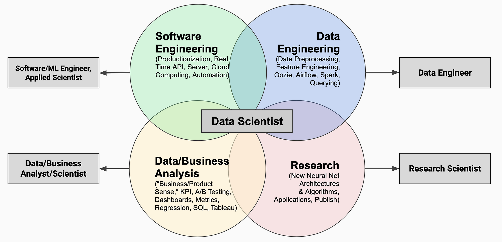
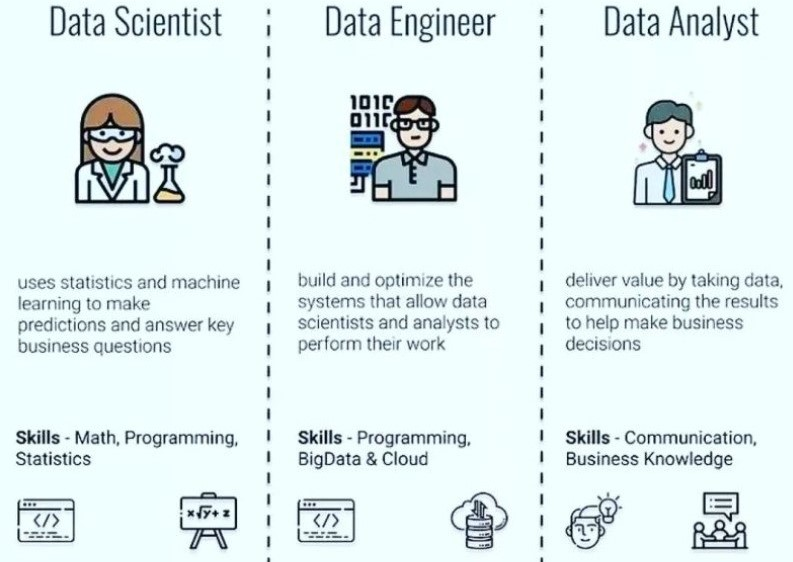

# Day_010 - Data Engineer vs Data Analytics vs Data Scientist vs ML Engineer

## 1. Data Engineer 
A Data Engineer focuses on building and maintaining the infrastructure to store and manage large datasets, ensuring data is accessible and optimized for analysis.

### Data Analyst
A Data Analyst primarily interprets and visualizes data to extract actionable insights.

## Data Scientist
A Data Scientist applies advanced algorithms and machine learning techniques to identify patterns and make predictions from data.

## ML Engineer
A ML Engineer takes the models developed by data scientists and deploys them into production systems, optimizing their performance and scalability. 

## Key Differences:
### Focus:
- **Data Engineer:** Data infrastructure, pipelines, data quality 
- **Data Analyst:** Data visualization, reporting, basic statistical analysis 
- **Data Scientist:** Advanced statistical modeling, machine learning algorithms, predictive analytics 
- **ML Engineer:** Model deployment, optimization, scaling in production environments 

### Technical Skills:
- **Data Engineer:** Database management, distributed computing (Hadoop, Spark), data warehousing, ETL processes 
- **Data Analyst:** SQL, data visualization tools (Tableau, Power BI), basic statistics 
- **Data Scientist:** Programming languages (Python, R), advanced statistics, machine learning algorithms 
- **ML Engineer:** Software engineering practices, cloud computing, deep learning frameworks 

## Example Workflows:
### Data Engineer:
Extracts data from various sources, cleans and transforms it, then loads it into a data warehouse for analysis. 

### Data Analyst:
Analyzes sales data to identify trends, creates reports and dashboards to visualize key metrics. 

### Data Scientist:
Develops a predictive model to identify customers likely to churn using historical data, evaluates model performance. 

### ML Engineer:
Deploys the churn prediction model to a production environment, monitors its performance, and optimizes its parameters. 

