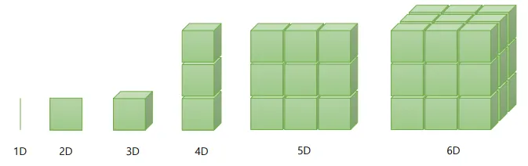
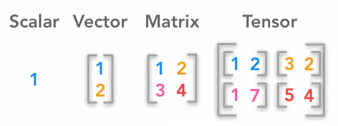

# Day_011 - Tensors

## What are Tensors?
`Tensor is a Data Structure or Container for Numbers`

A tensor is simply an n-dimensional array. It’s also a mathematical object that represents data in a way that is analogous to matrices. They are similar to matrices in many ways, but there are some important differences. For one, tensors can be of any rank, while matrices are always two-dimensional. Additionally, the size of a tensor is not necessarily limited to two dimensions.

```
In machine learning, a "Tensor" is a multi-dimensional array used to represent and manipulate data, 
essentially a generalization of matrices to higher dimensions, 
allowing for efficient storage and manipulation of complex data like images, videos, 
or time series, where each dimension represents a different aspect of the data.
they are the primary data structure used in deep learning frameworks like TensorFlow and PyTorch, 
enabling operations like matrix multiplication on data with multiple dimensions. 
```

## Rank, Axix, Shape
One of the essential properties of a tensor is its rank. The rank of a tensor is the number of dimensions it has. For example, a matrix has a rank of 2 because it has two dimensions (rows and columns). A rank 3 tensor, on the other hand, has three dimensions (height, width, and depth).

The size of a tensor is the number of elements it contains. For example, a matrix with 3 rows and 4 columns has a size of 12. A rank 3 tensor with 2 heights, 3 width, and 4 depth has a size of 24.

```
1. Rank = Axis = 2 (X, Y) or 3(X, Y, Z)
2. Shape = (3x3) or (4x4)
```



## Types of Tensors
**There are four types of tensors: vector, matrix, array, and scalar. Each type has its properties and uses.**

**Vector** tensors are used to represent directional data. They have a magnitude and direction but no specific location. Rank-1 tensors are usually called vectors. A vector is a mathematical object that describes a directed length. For example, the vector [2, 3] describes a directed length of two units in the positive x-direction and three units in the positive y-direction.

**Matrix** tensors are used to represent data that has a specific location. Rank-2 tensors are usually called matrices. A matrix is a mathematical object that describes a collection of vectors. For example, the matrix [1, 2] describes a collection of two vectors, [2, 3] and [-1, 4].

**Array** tensors are used to represent data that is spread out over a certain area.

**Scalar** tensors are used to represent data that has a single value.

```
1. OD-Tensor --> (2) --> Scalers
2. 1D-Tensor --> [1, 2, 3, 4] --> Vector/Array
3. 2D-Tensor --> [[1, 2, 3], [4, 5, 6]] --> Matrix
3. 3D-Tensor --> [[[1, 2, 3], [4, 5, 6]], [[1, 2, 3], [4, 5, 6]]] --> Matrix
4. ND-Tensor
```


## Example of Uses
```
1. 0D (Scalar) - Single data
2. 1D (Vector) - Entier Row or Column
3. 2D (Natrix) - A DataFrame
4. 3D (Tensor) - Times Series
5. 4D (Tensor) - Images
5. 5D (Tensor) - Videos
```