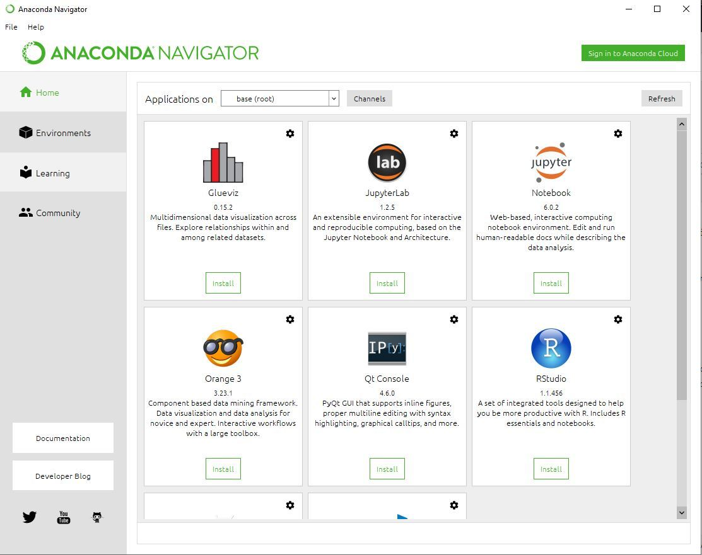

# Day_012 - Anaconda, Kaggle, Colab

```
1. Anaconda
2. Spyder
3. Kaggle
4. Colab
```

## 1. Anaconda
Anaconda is an open-source distribution of the Python and R programming languages. It's used to develop and manage data science and artificial intelligence (AI)



## 2.Spyder
Spyder is an open-source, cross-platform Integrated Development Environment (IDE) specifically designed for scientific Python programming, offering advanced editing, debugging, analysis, and data exploration features, and seamlessly integrating with popular scientific libraries like NumPy, SciPy, and Pandas; essentially, it's a powerful tool for data scientists and researchers working with Python. 


## 3. Kaggle
Kaggle is a web platform that connects data scientists and machine learning practitioners to compete in challenges, share data, and learn from each other. It's the world's largest data science community. 


## 4. Colab
Colab, or Google Colaboratory, is a free, cloud-based tool that allows users to write and run Python code in a web browser. It's a Jupyter Notebook environment that runs in Google Cloud. 
