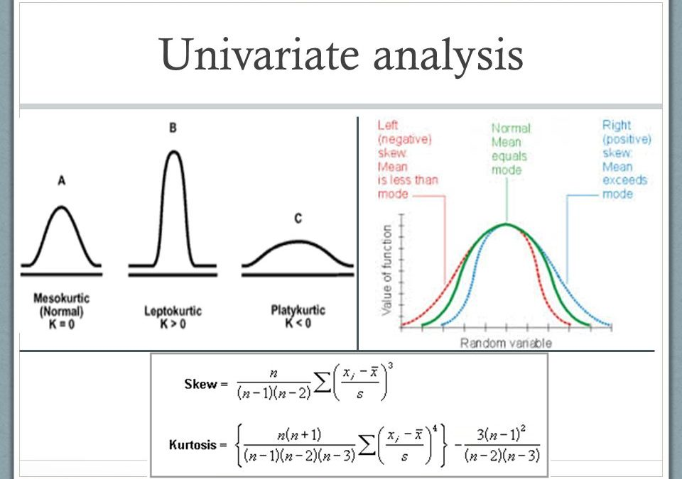

# Day_020-Univariate Analysis
Univariate analysis is a statistical technique that examines a single variable in a data set. It's the most basic type of data analysis. The goal of univariate analysis is to describe the data and find patterns. 

## How it's used 
- To make data easier to understand
- To understand how data is distributed
- To screen data
- To evaluate if data meets assumptions for more complex statistical analyses

## What it doesn't do
-  Univariate analysis doesn't look at cause-and-effect -  relationships 
-  It doesn't look at more than one variable at a time 
-  It doesn't answer research questions about -  relationships between variables 

## Examples of univariate analysis 
-  Examining the age of employees in a company
-  Counting how many boys and girls are in a classroom

## Methods for univariate analysis 
Calculations of frequencies, Central tendency, Dispersion, Bar charts, Histograms, Frequency polygons, and Pie charts.

## Related analysis
Bivariate analysis studies two variables and their relationships, while multivariate analysis studies three or more variables. 

