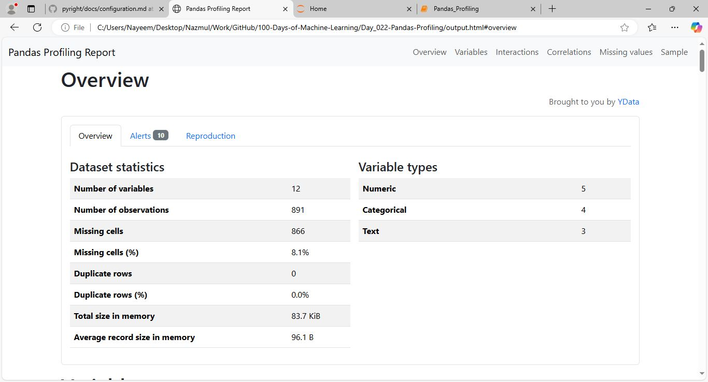

# Day_022-Pandas Profiling
`pandas-profiling` primary goal is to provide a one-line Exploratory Data Analysis (EDA) experience in a consistent and fast solution. Like pandas df.describe() function, that is so handy, pandas-profiling delivers an extended analysis of a DataFrame while alllowing the data analysis to be exported in different formats such as html and json.

## Install Pandas-Profiling
```bash
!pip install pandas-profiling

!pip install ydata-profiling
```

## Build Profile
```python
from pandas_profiling import ProfileReport

# Assuming 'df' is your pandas DataFrame
prof = ProfileReport(df)
prof.to_file(output_file='output.html')
```

