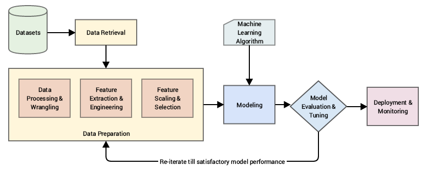

# Day-023-Introduction to Features Engineering

## What is Feature Engineering?
Feature engineering is the process of transforming raw data into features that are suitable for machine learning models. In other words, it is the process of selecting, extracting, and transforming the most relevant features from the available data to build more accurate and efficient machine learning models.

## Processes Involved in Feature Engineering
1. Features Transformation
2. Features Constraction
3. Features Selection
4. Features Extraction

## 1. Features Transformation
Feature Transformation is the process of transforming the features into a more suitable representation for the machine learning model. This is done to ensure that the model can effectively learn from the data.

1. Missing Value Imputation
2. Handling Categorical Features
3. Outlier Detection
4. Features Scaling

### Types of Feature Transformation:
- **Normalization:** Rescaling the features to have a similar range, such as between 0 and 1, to prevent some features from dominating others.
- **Scaling:** Scaling is a technique used to transform numerical variables to have a similar scale, so that they can be compared more easily. Rescaling the features to have a similar scale, such as having a standard deviation of 1, to make sure the model considers all features equally.
- **Encoding:** Transforming categorical features into a numerical representation. Examples are one-hot encoding and label encoding.
- **Transformation:** Transforming the features using mathematical operations to change the distribution or scale of the features. Examples are logarithmic, square root, and reciprocal transformations.

## 3. Feature Extraction
Feature Extraction is the process of creating new features from existing ones to provide more relevant information to the machine learning model. This is done by transforming, combining, or aggregating existing features.

### Types of Feature Extraction:
- **Dimensionality Reduction:** Reducing the number of features by transforming the data into a lower-dimensional space while retaining important information. Examples are PCA and t-SNE.
- **Feature Combination:** Combining two or more existing features to create a new one. For example, the interaction between two features.
- **Feature Aggregation:** Aggregating features to create a new one. For example, calculating the mean, sum, or count of a set of features.
- **Feature Transformation:** Transforming existing features into a new representation. For example, log transformation of a feature with a skewed distribution.

## 4. Feature Selection
Feature Selection is the process of selecting a subset of relevant features from the dataset to be used in a machine-learning model. It is an important step in the feature engineering process as it can have a significant impact on the model’s performance.

### Types of Feature Selection:
- **Filter Method:** Based on the statistical measure of the relationship between the feature and the target variable. Features with a high correlation are selected.
- **Wrapper Method:** Based on the evaluation of the feature subset using a specific machine learning algorithm. The feature subset that results in the best performance is selected.
- **Embedded Method:** Based on the feature selection as part of the training process of the machine learning algorithm.

