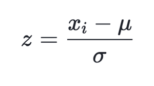
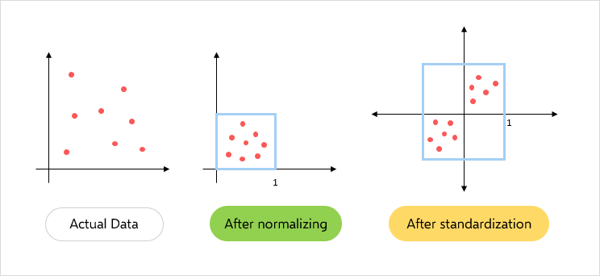

# Day_024-Features Engineering Part 02 - Standardization

## Understanding standardization
We have a solution to solve the problem arisen i.e. Standardization. It helps us solve this by : 

- Down Scaling the Values to a scale common to all, usually in the range -1 to +1.
- And keeping the Range between the values intact.
  
So, how do we do that? we’ll there’s a mathematical formula for the same i.e., Z-Score = (Current_value – Mean) / Standard Deviation.



Using this formula we are replacing all the input values by the Z-Score for each and every value. Hence we get values ranging from -1 to +1, keeping the range intact.

## Standardization performs the following:

- **Converts the Mean (μ) to 0**
- **Converts to S.D. (σ) to 1**
  
It’s pretty obvious for Mean = 0 and S.D = 1 as all the values will have such less difference and each value will nearly be equal 0, hence Mean = 0 and S.D. = 1.

# NOTE : (Just for Better Understanding)
**For Mean**
```
When we Subtract a value Smaller than the Mean we get (-ve) Output
When we Subtract a value Larger than the Mean we get (+ve) Output
```

## Here we are doing the Following:

- **Calculating the Z-Score**
- **Comparing the Original Values and Standardized Values**
- **Comparing the Range of both using Scatter Plots**

