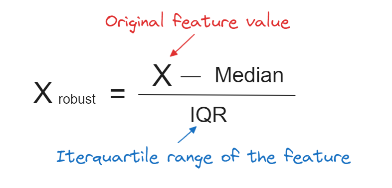

# Day_25-Normalization
Normalization is a scaling technique in which values are shifted and rescaled so that they end up ranging between 0 and 1. It is also known as Min-Max scaling.

## Divide into some part
1. Min-Max Scaling
2. Mean-Normalization
3. Absolute Maximum Scaling
4. Robust Scaling

### 1. Min-Max Scaling

### 2. Mean-Normalization

### 3. Absolute Maximum Scaling

### 4. Robust Scaling
In this method of scaling, we use two main statistical measures of the data.
- **Median**
- **Inter-Quartile Range**

