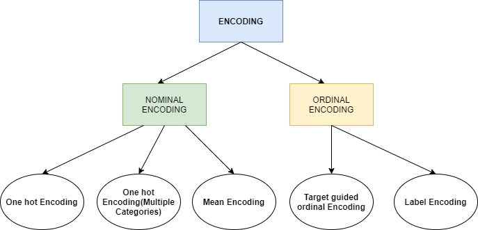
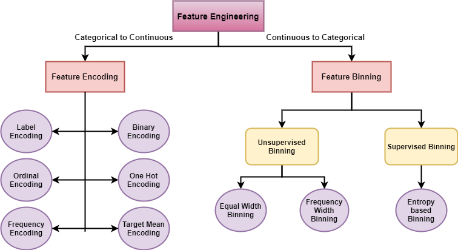

# Day_026-Encoding_Features-Ordinal_Encoding
Machine learning algorithms often work best with numerical input.  Feature encoding is the process of converting categorical variables (text or other non-numerical data) into numerical representations that a machine learning model can understand.  This is crucial because many datasets contain categorical features, and without encoding, the model won't be able to learn from them effectively.

## Why Encode Categorical Features?
- **Algorithm Compatibility:** Most machine learning algorithms are designed to work with numerical data.
- **Improved Performance:** Proper encoding can significantly improve the accuracy and efficiency of your models. Incorrect encoding can lead to misleading results or prevent the model from converging.
- **Feature Representation:** Encoding transforms categorical data into a format that captures the underlying information in a way that the model can interpret.

## Types of Categorical Variables:
- **Nominal:** Categories have no inherent order (e.g., colors, types of fruit).
- **Ordinal:** Categories have a meaningful order (e.g., education level, customer satisfaction ratings).


## Common Feature Encoding Techniques:
### 1. One-Hot Encoding:
-  **Use Case:**  Primarily for nominal variables.

- **How it Works:** Creates a new binary (0 or 1) column for each category.  If a data point belongs to a category, the corresponding column gets a 1, and all other columns get a 0.

- **Example:**  Colors: [Red, Blue, Green] becomes:

    +  **Red: [1, 0, 0]**
    + **Blue: [0, 1, 0]**
    + **Green: [0, 0, 1]**
- **Advantages:**  Simple, prevents the model from interpreting ordinal relationships where none exist.

- **Disadvantages:** Can lead to high dimensionality (many columns) if there are many categories, potentially increasing computational cost and memory usage.

### 2. Label Encoding:
- **Use Case:** Can be used for ordinal variables, sometimes for nominal if the number of categories is small and there's no risk of misinterpretation.

- **How it Works:** Assigns a unique integer to each category.

- **Example:** Education: [High School, Bachelor's, Master's] becomes:
  + **High School: 0**
  + **Bachelor's: 1**
  + **Master's: 2**
  
- **Advantages:** Simple, doesn't increase dimensionality.

- **Disadvantages:** Introduces an artificial order to nominal variables, which can mislead the model. Should be used with caution for ordinal variables if the assigned numerical order doesn't align with the true order.


### 3. Ordinal Encoding:
- **Use Case:** Specifically for ordinal variables.
- **How it Works:** Assigns integers to categories based on their order.  The order is crucial.
- **Example:** Satisfaction: `[Low, Medium, High] `becomes:
    + **Low: 1**
    + **Medium: 2**
    + **High: 3**
  
- **Advantages:** Preserves the ordinal relationship between categories.

- **Disadvantages:** Requires careful consideration of the correct order.

### 4. Target Encoding (Mean Encoding):

- **Use Case:** Can be used for nominal or ordinal variables, especially when there are many categories.
- **How it Works:** Replaces each category with the mean of the target variable for that category.
- **Example:** If "City" is a feature, each city would be replaced by the average income for people in that city.
- **Advantages:** Can capture information about the relationship between the categorical variable and the target.
- **Disadvantages:** Prone to overfitting if not handled carefully (e.g., using techniques like smoothing or cross-validation)


## Choosing the Right Encoding Technique:
### The best technique depends on:

```
1. Type of variable (nominal, ordinal):
2. Number of categories (cardinality):
3. Relationship with the target variable:
4. The specific machine learning algorithm being used:
```

### Important Considerations:
> 1. Handling unseen values: Plan how to deal with new categories that might appear in the test data but weren't in the training data.
> 2. Regularization: Techniques like L1 or L2 regularization can help prevent overfitting when using one-hot encoding with high-cardinality features.




