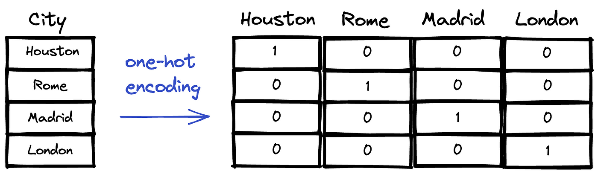
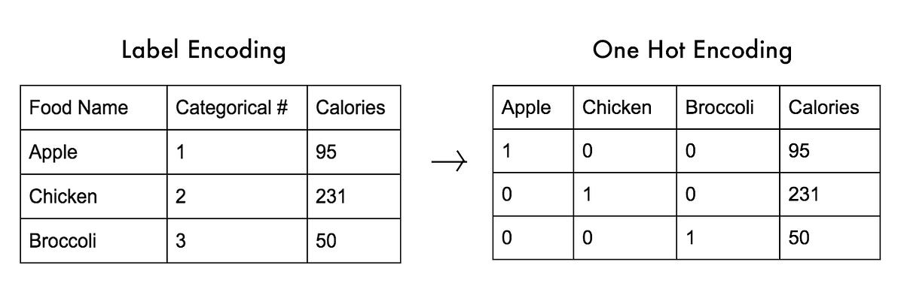

# Day_27-One Hot Encoding
It's is a method for converting categorical variables into a binary format.

## 1. Using Pandas

```python
pd.get_dummies(df, columns=['fuel', 'owner'], drop_first=True)
```

## 2. One Hot Encoding using Scikit Learn Library

```python
from sklearn.preprocessing import OneHotEncoder
ohe = OneHotEncoder(drop='first', sparse_output=False, dtype=np.int32)

ohe.fit(df[['fuel', 'owner']])
X_train_new = ohe.transform(X_train[['fuel', 'owner']])
X_test_new = ohe.transform(X_test[['fuel', 'owner']])
```

## 3. OHE on Brand (Most Frequent Data)
```python
counts = df['brand'].value_counts()
df['brand'].nunique()
rpls = counts[counts <= 100].index
len(rpls)
pd.get_dummies(df['brand'].replace(rpls, 'uncommon'))
```


