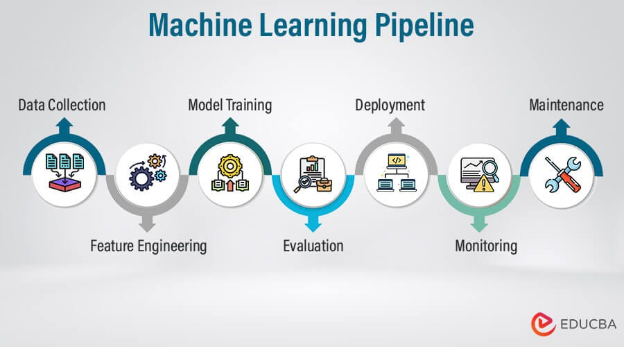
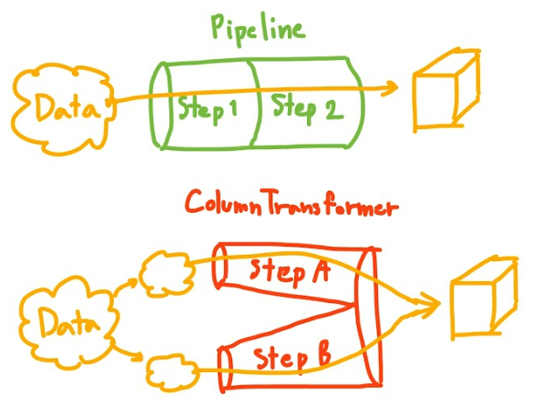
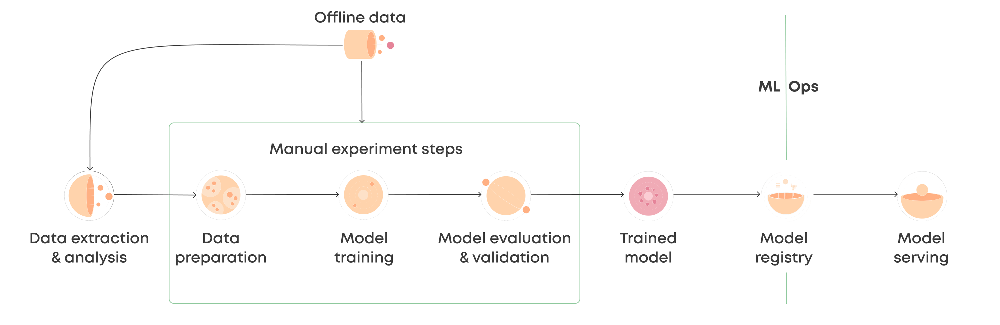

# Day_29-Pipeline
A pipeline in scikit-learn is a way to chain together multiple data processing steps and a final estimator (like a machine learning model) into a single object.  It streamlines your machine learning workflow by.

## Where Pipelines are Used:
- **Preprocessing:** When you need to clean, transform, or prepare your data before feeding it to a model. This might include handling missing values, encoding categorical variables, scaling numerical features, or dimensionality reduction.   
- **Feature Engineering:** If you create new features from existing ones to improve your model's performance, you'll want to include these steps in your pipeline.   
Model Training: The final step in the pipeline is usually training a machine learning model on the processed data.
- **Model Deployment:** When you put your model into production, you need to apply the same preprocessing steps to new data before making predictions. Pipelines make this process consistent and reliable.   
Cross-Validation: Pipelines are essential for proper cross-validation, ensuring that preprocessing steps are applied within each fold to prevent data leakage.

## In essence, pipelines are used to:
+ Simplify and automate machine learning workflows
+ Improve the reliability and reproducibility of results.
+ Prevent common errors like data leakage.   
+ Make model deployment easier.

[Reference_Link](https://github.com/campusx-official/100-days-of-machine-learning/tree/main/day29-sklearn-pipelines)

## Images

   
