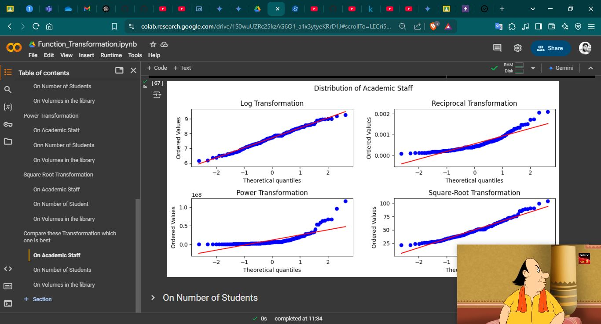

# Day_30-Function Transformation

## Why Transform Features?
Many machine learning algorithms perform best when the features have a roughly normal (Gaussian) distribution.  Real-world data, however, often violates this assumption. Function transformations can help by:   

- **Reducing Skewness:** Skewed data can negatively impact model performance. These transformations can make the distribution more symmetrical.   
Handling Outliers: Transformations can compress the range of extreme values, reducing the influence of outliers.   
- **Improving Model Fit:** Some models, particularly linear models, assume a linear relationship between features and the target variable. Transformations can help linearize this relationship.   
- **Stabilizing Variance:** In some cases, the variance of a feature might be related to its mean. Transformations can help stabilize the variance. 

## 1. Log Transformation:
- **Formula:** `y = log(x)` (or `y = log1p(x)` if your data contains zeros; log1p adds 1 before taking the log).
- **Use Cases:** Primarily used when dealing with positively skewed data and when the feature values are all positive. It's particularly effective when the data spans several orders of magnitude. Common in fields like finance and demographics.   
- **Effect:** Compresses the higher values more than the lower values, making the distribution less skewed. Can also help linearize relationships where the effect of the feature diminishes as its value increases.   
- **Example:** Income data is often positively skewed. A log transformation can make the distribution more normal.   

### Python Code using Numpy
```python
import numpy as np
import matplotlib.pyplot as plt
from scipy import stats

# Sample positively skewed data
data = stats.lognorm.rvs(5, size=1000)  # Example skewed data

# Original data
plt.hist(data, bins=50)
plt.title("Original Data (Positively Skewed)")
plt.show()

# Log transformation (with log1p to handle potential zeros)
log_transformed_data = np.log1p(data)

# Transformed Data
plt.hist(log_transformed_data, bins=50)
plt.title("Log Transformed Data")
plt.show()
```

## 2. Reciprocal Transformation:
- **Formula:** `y = 1/x`
- **Use Cases:** Useful for positively skewed data where the values are all positive and non-zero. Less common than the log transformation. Best suited when the impact of the feature diminishes very quickly as its value increases.   
- **Effect:** Compresses high values even more aggressively than the log transformation.
- **Caution:** Cannot be applied to zero values. Careful consideration is needed as it can drastically alter the meaning of the feature.
- **Example:** The time it takes to complete a task. A shorter time has a much bigger impact than a slightly longer time.
### Python Code
```python
reciprocal_transformed_data = 1 / data  # Be careful with zeros!
# ... Plot the histogram of reciprocal_transformed_data
```

## 3. Square Root Transformation:
- **Formula:** `y = sqrt(x)`
- **Use Cases:** Used for positively skewed data, similar to the log transformation, but less aggressive. Can be applied to zero values. A good middle ground between no transformation and a strong log transformation.
- **Effect:** Compresses higher values, but not as much as the log or reciprocal transformations.
- **Example:** Number of customer complaints.
### Python Code:
```python
sqrt_transformed_data = np.sqrt(data)
# ... Plot the histogram of sqrt_transformed_data
```

## Important Considerations:
- **Zero and Negative Values:** Log and reciprocal transformations cannot be applied to zero or negative values. You might need to add a constant (like 1) to all values before transforming (e.g., `log1p`).
- **Inverse Transformation:** If you transform your features for training, you'll need to apply the inverse transformation to your model's predictions to get them back in the original scale.
- **Scikit-learn:** Scikit-learn provides transformers like `PowerTransformer` (for Box-Cox and Yeo-Johnson), `QuantileTransformer`, and `FunctionTransformer` that can be used within pipelines.


## My_Code
### All types of Function Transform is one File `Function_Transformation.ipynb`
1. Log Transformation
2. Reciprocal Transformation
3. Power Transformation
4. Square-Root Transformation



