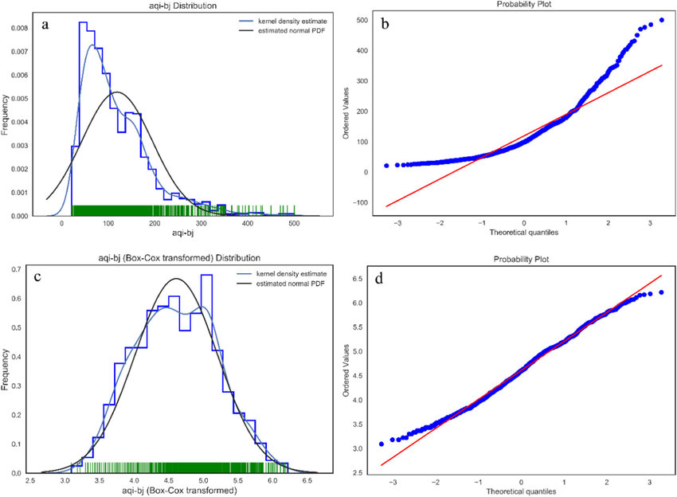
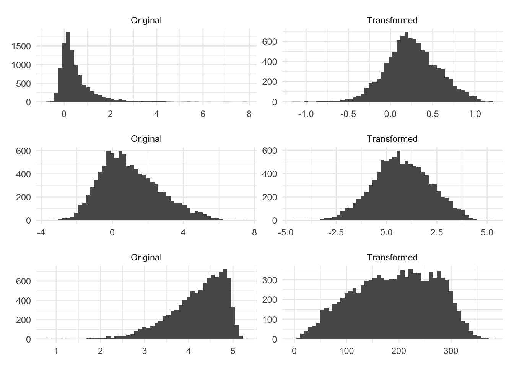

# Day_031-Power Transformation
1. Box-Cox Transformation
2. Yeo-Johnson Transformation

Power transformations are a set of functions that replace the original variable x with x raised to some `power λ (lambda)`
- **The general formula is: **
> y = x<sup>λ</sup>


## Types of Power Transformations:
### 1. Box-Cox Transformation:

This is a family of transformations that includes the log transformation as a special case.  It's defined as:

> If λ ≠ 0: y = (x<sup>λ</sup> - 1) / λ </br>
> If λ = 0: y = log(x)

- **Use Cases:** Suitable for positive data. It can handle a wider range of distributions than just the log transformation.  It estimates the optimal λ to normalize the data.

- **Advantages:** More flexible than the log transform.  Can often find a better transformation for the data.

- **Disadvantages:** Assumes the data is positive.  Can be sensitive to outliers.

### Yeo-Johnson Transformation:
This is a more general power transformation that can be applied to both positive and negative data. It's a modification of the `Box-Cox transformation` that handles `zero` and `negative values`.
- **Use Cases:** Suitable for data that may contain negative or zero values.
- **Advantages:** Can handle a wider range of data than the Box-Cox transformation. No restriction on data positivity.
- **Disadvantages:** Slightly more computationally intensive than Box-Cox.

## Why Use Power Transformations?
- **Normality:** Many statistical methods and machine learning algorithms assume that the data is normally distributed. Power transformations can help make the data more normally distributed, improving the performance of these methods.
- **Variance Stabilization:** In some cases, the variance of a variable might be related to its mean. Power transformations can help stabilize the variance, which can be important for some statistical analyses.
- **Outlier Handling:** Power transformations can sometimes reduce the influence of outliers by compressing the range of extreme values.

## How to Choose the Right Power Transformation:
- **Visualize:** Always plot histograms and Q-Q plots of your data before and after transformation to see the effect on the distribution.
- **Scikit-learn:** Use the PowerTransformer class in scikit-learn. You can specify whether you want to use the Box-Cox or Yeo-Johnson transformation. PowerTransformer will automatically estimate the optimal λ for your data.

```python
from sklearn.preprocessing import PowerTransformer
import numpy as np
import matplotlib.pyplot as plt
from scipy import stats

# Example skewed data (positive)
data_positive = stats.lognorm.rvs(5, size=1000)

# Example data with negative values
data_mixed = np.concatenate([stats.norm.rvs(loc=-2, scale=1, size=500), stats.norm.rvs(loc=2, scale=1, size=500)])

# Box-Cox Transformation (for positive data)
pt_boxcox = PowerTransformer(method='box-cox')
data_boxcox = pt_boxcox.fit_transform(data_positive.reshape(-1, 1)) # Reshape is important

# Yeo-Johnson Transformation (for mixed data)
pt_yeojohnson = PowerTransformer(method='yeo-johnson')
data_yeojohnson = pt_yeojohnson.fit_transform(data_mixed.reshape(-1, 1)) # Reshape is important


# Plotting
fig, axes = plt.subplots(2, 2, figsize=(12, 8))

axes[0, 0].hist(data_positive, bins=50); axes[0, 0].set_title("Original Positive Data")
axes[0, 1].hist(data_boxcox, bins=50); axes[0, 1].set_title("Box-Cox Transformed Data")
axes[1, 0].hist(data_mixed, bins=50); axes[1, 0].set_title("Original Mixed Data")
axes[1, 1].hist(data_yeojohnson, bins=50); axes[1, 1].set_title("Yeo-Johnson Transformed Data")

plt.tight_layout()
plt.show()

# To get the lambda value used:
print("Box-Cox Lambda:", pt_boxcox.lambdas_)
print("Yeo-Johnson Lambda:", pt_yeojohnson.lambdas_)

# Inverse transform
original_data_restored = pt_boxcox.inverse_transform(data_boxcox)
```
[Reference_Link_Gemini](https://gemini.google.com/app/)



