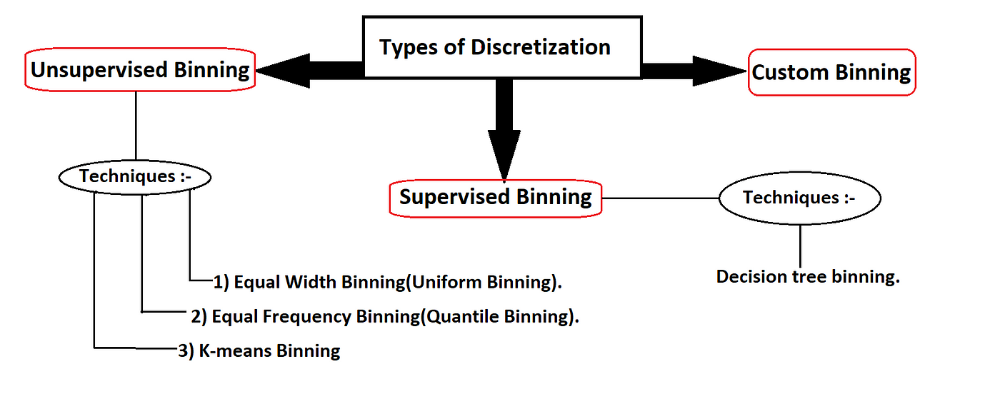
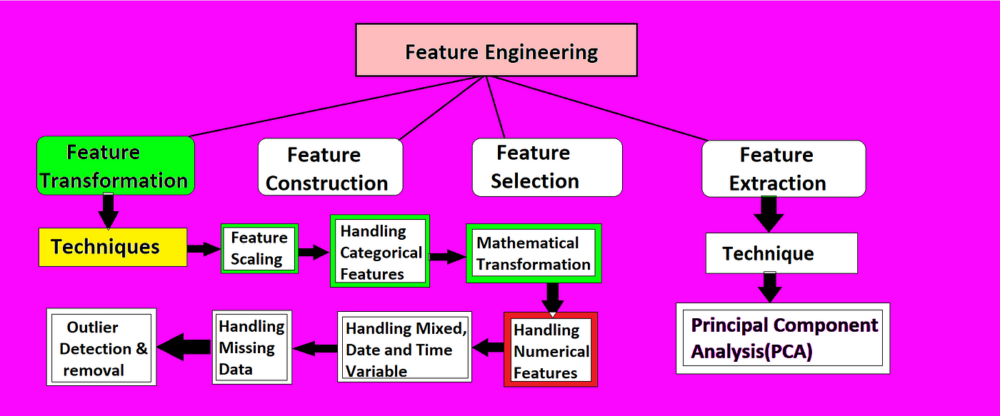
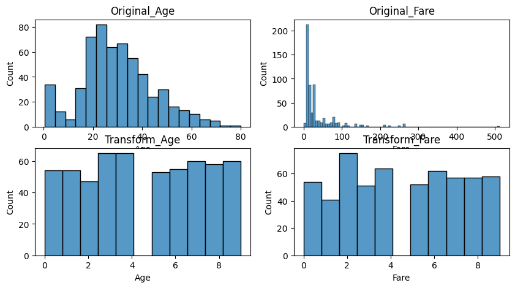

# Day_032-Binning(Discretization) and Binarization
Discretization and binarization are data transformation techniques that convert continuous data into discrete or binary values.

## Discretization 
- Groups continuous values into intervals
- Transforms continuous variables into discrete variables
- Can be performed by `binning`, `clustering`, `decision - trees`, `correlation analysis`, or `histogram` analysis
- Can be used to transform `numeric` values `into - conceptual` labels
- For example, `age` can be transformed into `youth`, `adult`, or `senior`.

## Binarization 
- Converts data into binary formats, typically `0` and `1`
- A special form of discretization
- Useful when dealing with algorithms that perform better with binary input

## When to use
Discretization and binarization are often used before training machine learning algorithms. They are also useful for transforming continuous data for effective analysis in data mining. 

## [My_Code_n_Output](zzz)

