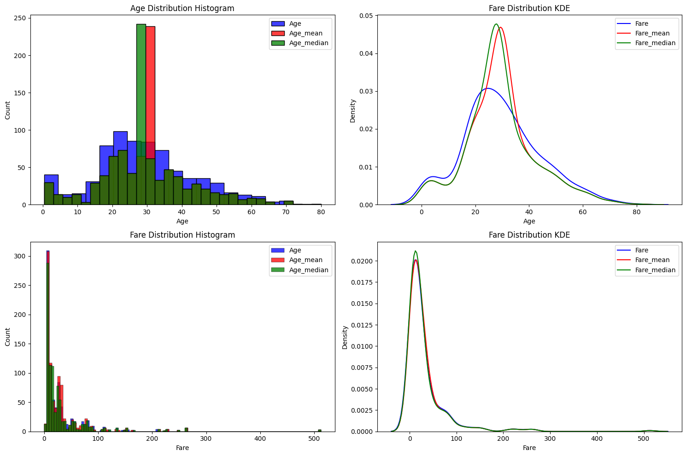
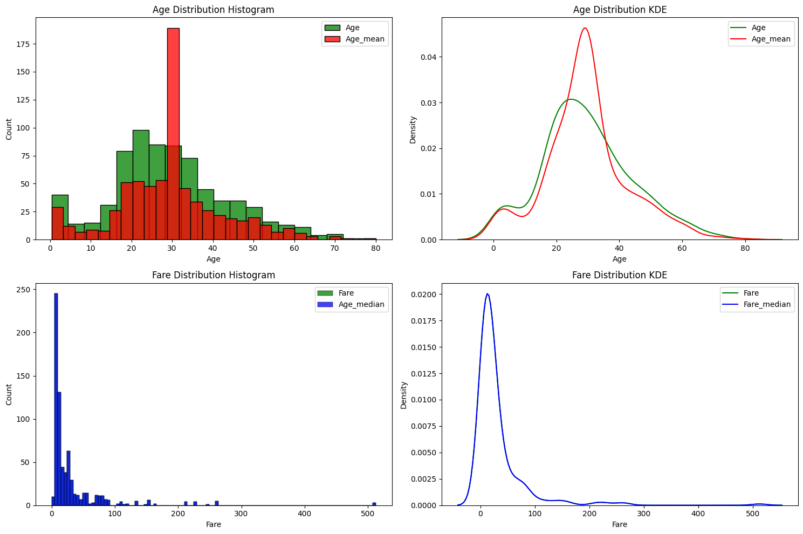

# Day_036-Handling Missing Value of Numarical Variable

There are two type to impute
1. Univariate
2. Multivariate

## 1. Univariate
1. Mean
2. Median
3. Arbitrary
4. End of Distribution
5. Randomly
6. Automatically subset

## 2. Multivariate
1. KNN
2. Iterator

## 1. Fill by `Mean` and `Meadian` using `Pandas` and `Numpy`
1. Using `pandas`

2. Using `sklearn`
