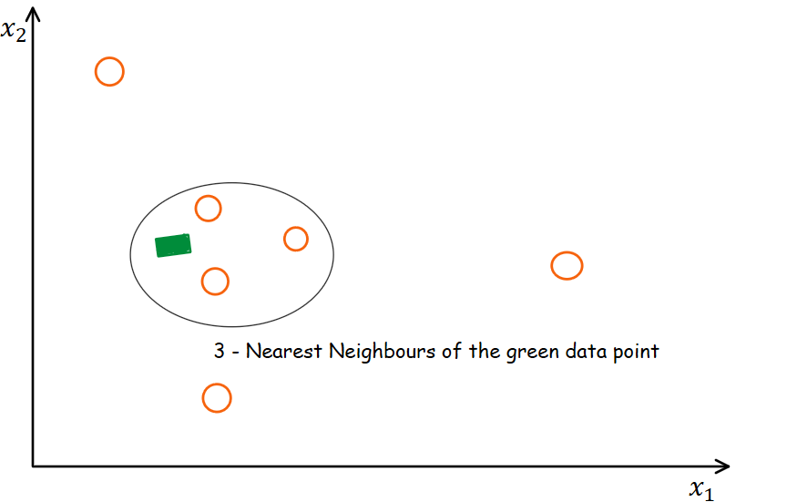
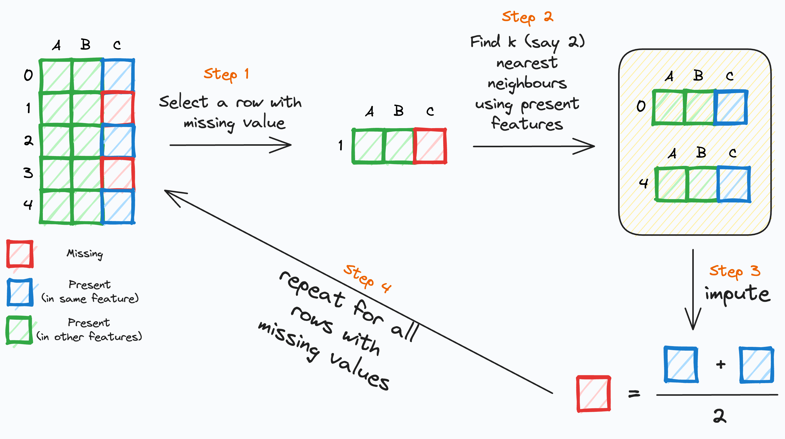

# Day_039 | Multivariate | KNN imputer
- KNN (K-Nearest Neighbors) imputation is a method that uses the KNN algorithm to estimate and replace missing values.
- Instead of simply filling missing values with the mean or median, KNN imputation looks at the "nearest neighbors" of a data point with a missing value and uses their values to estimate the missing value.

## How it Works:
1. Distance Calculation:
    - For each data point with a missing value, the algorithm calculates the distance between that point and all other data points in the dataset.
    - Common distance metrics include Euclidean distance, which is often used for numerical data.

2. Finding Nearest Neighbors:
    - The algorithm identifies the "k" nearest neighbors, which are the data points closest to the one with the missing value.
   - The "k" parameter is a user-defined value that determines how many neighbors to consider.

3. Imputation:
    - The missing value is then imputed using the values of the k-nearest neighbors.
    - For numerical data, this is typically done by calculating the mean or median of the neighbors' values.
    - For categorical data, the mode of the neighbor values can be used.
  
## Key Advantages:
1. Multivariate Imputation:
    - KNN imputation considers multiple features, allowing it to capture relationships between variables. This often leads to more accurate imputations than univariate methods (like mean/median imputation).
2. Preserves Relationships:
    - By using similar data points for imputation, KNN helps preserve the underlying structure and relationships within the dataset.
3. Handles Various Data Types:
    - While primarily designed for numerical data, with proper encoding, it can be adapted to handle categorical data as well.

## Key Disadvantages:
1. Computational Cost:
    - Calculating distances between data points can be computationally expensive, especially for large datasets.
2. Sensitivity to Outliers:
    - Outliers can influence the selection of nearest neighbors and distort the imputed values.
3. Choosing "k":
    - The choice of the "k" parameter can significantly impact the results. A small "k" can be sensitive to noise, while a large "k" can smooth out important variations.
4. Data Scaling:
    - Because KNN is distance based, it is very important to scale your numerical data before using a KNN imputer.


## Implementation in Scikit-learn:
Scikit-learn provides the `KNNImputer` class, which makes it easy to implement KNN imputation in Python.

> Python 3.0
```python
import pandas as pd
import numpy as np
from sklearn.impute import KNNImputer

# Create a sample DataFrame with missing values
data = {'A': [1, 2, np.nan, 4, 5, 6],
        'B': [7, np.nan, 9, 10, 11, 12],
        'C': [13, 14, 15, np.nan, 17, 18]}
df = pd.DataFrame(data)

print("Original DataFrame:\n", df)

# Initialize the KNNImputer
imputer = KNNImputer(n_neighbors=2)  # Choose the number of neighbors (k)

# Fit and transform the DataFrame
df_imputed = pd.DataFrame(imputer.fit_transform(df), columns=df.columns)

print("\nDataFrame after KNN imputation:\n", df_imputed)

# Example with scaling numerical data
from sklearn.preprocessing import StandardScaler

data2 = {'A': [1, 10, np.nan, 4, 5, 6],
        'B': [7, np.nan, 9, 10, 11, 100],
        'C': [13, 14, 15, np.nan, 17, 18]}
df2 = pd.DataFrame(data2)

scaler = StandardScaler()
scaled_data = scaler.fit_transform(df2)

imputer2 = KNNImputer(n_neighbors=2)
imputed_scaled_data = imputer2.fit_transform(scaled_data)

imputed_df2 = pd.DataFrame(scaler.inverse_transform(imputed_scaled_data), columns = df2.columns)

print("\n DataFrame after scaling and KNN imputation:\n", imputed_df2)

#Example with categorical data (needs encoding)
from sklearn.preprocessing import OrdinalEncoder

data3 = {'A': [1, 2, np.nan, 4, 5, 6],
        'B': ['cat', np.nan, 'dog', 'cat', 'bird', 'dog']}
df3 = pd.DataFrame(data3)

encoder = OrdinalEncoder()
df3['B'] = encoder.fit_transform(df3[['B']])

imputer3 = KNNImputer(n_neighbors=2)
df3_imputed = pd.DataFrame(imputer3.fit_transform(df3), columns = df3.columns)

df3_imputed['B'] = encoder.inverse_transform(df3_imputed[['B']])

print("\nDataFrame with categorical data after KNN imputation:\n",df3_imputed)
```


