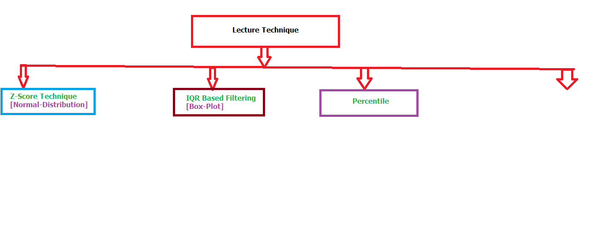

# Day 041 | Outlier

## How to detect outlier:
1.  **Visual Methods:**
    1.  Box Plots
    2.  Scatter-Plot
    3.  Histogram
2.  **Statistical Methods:**
    1.  Z-Score
    2.  Interquartile Range (IQR)
    3.  Modified Z-Score
    4.  DBSCAN (Density-Based Spatial Clustering of Applications with Noise)
    5.  Isolation Forest
    6.  Local Outlier Factor (LOF)

## Treat on Outlier
1. Removal/Trimming
2. Capping/Flooring (Winsorizing)
3. Impute as a Missing
4. Transformation
5. Separate Analysis
6. Robust Models

> Python
```python
import pandas as pd
import numpy as np
import seaborn as sns
import matplotlib.pyplot as plt
from scipy import stats

# Sample data
data = {'values': np.concatenate([np.random.normal(0, 1, 100), [10, -10]])}
df = pd.DataFrame(data)

# Box plot
sns.boxplot(x=df['values'])
plt.show()

# Z-score
df['z_score'] = np.abs(stats.zscore(df['values']))
outliers_z = df[df['z_score'] > 3]
print("Z-score outliers:\n", outliers_z)

# IQR
Q1 = df['values'].quantile(0.25)
Q3 = df['values'].quantile(0.75)
IQR = Q3 - Q1
outliers_iqr = df[(df['values'] < Q1 - 1.5 * IQR) | (df['values'] > Q3 + 1.5 * IQR)]
print("\nIQR outliers:\n", outliers_iqr)

# Capping/Flooring
upper_limit = df['values'].quantile(0.95)
lower_limit = df['values'].quantile(0.05)
df['capped_values'] = np.clip(df['values'], lower_limit, upper_limit)
print("\nCapped values:\n", df['capped_values'])
```

!