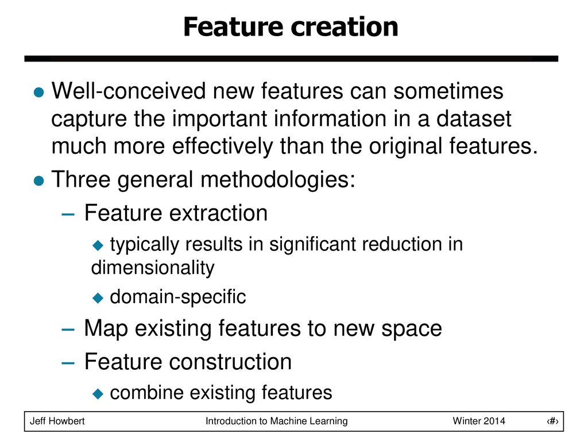
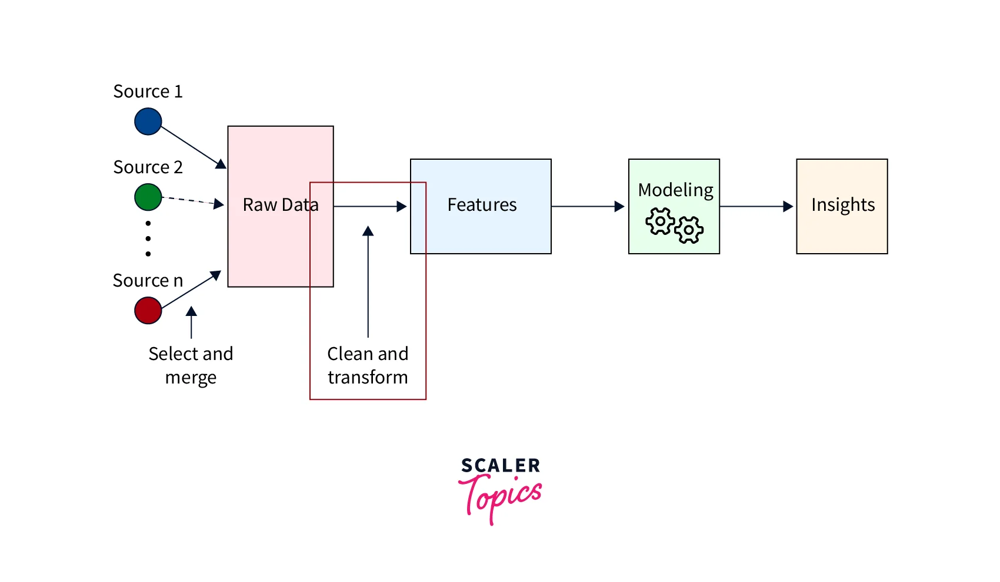

# Day_045 | Features Construction
Feature construction, also known as feature engineering, is the process of creating new features from existing ones to improve the performance of machine learning models. It involves 1  transforming raw data into features that better represent the underlying problem to the predictive models.


## Common feature construction techniques:

1. Creating Interaction Features:
- **Concept:** Multiply or combine existing features to capture interactions between them.
- **Example:** If you have `age` and `income` features, you can create an interaction feature `age * income` to capture the combined effect of age and income.

>Python
```python
import pandas as pd

df['age_income'] = df['age'] * df['income']
```

2. Polynomial Features:
- **Concept:** Create polynomial combinations of existing features (e.g., squared, cubed).
- **Example:** If you have a feature "x", you can create features "x^2" and "x^3".

> Python (scikit-learn):
```python
from sklearn.preprocessing import PolynomialFeatures

poly = PolynomialFeatures(degree=2)  # Create squared features
poly_features = poly.fit_transform(df[['x']])
```

3. Binning/Discretization:
- **Concept:** Convert continuous numerical features into discrete categorical features by grouping values into bins.
- **Example:** Group `age` into age ranges (e.g., 0-18, 19-30, 31-50, 51+).

>Python (pandas):
```python
bins = [0, 18, 30, 50, 100]
labels = ['0-18', '19-30', '31-50', '51+']
df['age_group'] = pd.cut(df['age'], bins=bins, labels=labels)
```

4. Feature Decomposition:
- **Concept:** Decompose complex features into simpler components.
- **Example:** Decompose a date feature into `year`, `month`, and `day` features.

> Python (pandas):
```python
df['date'] = pd.to_datetime(df['date'])
df['year'] = df['date'].dt.year
df['month'] = df['date'].dt.month
df['day'] = df['date'].dt.day
```

5. Domain-Specific Features:

- **Concept:** Create features based on domain knowledge.
- **Example:** In a text analysis task, create features like `number of words`, `number of punctuation marks`, or `sentiment score`.
- **Example:** In financial data, create features like `return on investment`, `debt-to-equity ratio`.

> Python
```python
df['word_count'] = df['text'].apply(lambda x: len(x.split()))
```

6. Aggregation Features:

- **Concept:** Aggregate data over groups to create new features.
- **Example:** If you have transaction data, create features like `total spending per customer`, `average transaction amount per customer`.

> Python (pandas):
```python
customer_spending = df.groupby('customer_id')['amount'].sum().reset_index()
```

7. One-Hot Encoding/Dummy Variables:
- **Concept:** Convert categorical features into numerical features using one-hot encoding.
- **Example:** Convert a `color` feature (red, green, blue) into three binary features (is_red, is_green, is_blue).

> Python (pandas):
```python
df = pd.get_dummies(df, columns=['color'])
```

8. Feature Scaling/Normalization:
- **Concept:** Transform numerical features to a common scale.
- **Example:** Use standardization `(Z-score scaling)` or `min-max scaling`.

> Python (scikit-learn):
```python
from sklearn.preprocessing import StandardScaler

scaler = StandardScaler()
df['scaled_feature'] = scaler.fit_transform(df[['feature']])
```

9. Log Transformations:
- **Concept:** Apply a logarithmic transformation to skewed numerical features.
- **Example:** `df['log_feature'] = np.log1p(df['feature'])` (using log1p to handle zero values).

> Python
```python
df['log_feature'] = np.log1p(df['feature'])
```

10. Ratio Features:
- **Concept:** Calculate ratios between features.
- **Example:** Create a `debt-to-income` ratio feature.

> Python
```python
import pandas as pd
import numpy as np
```


