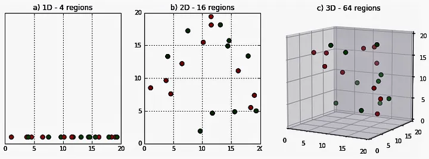

# Day 046 | Curse of Dimentionality
The curse of dimensionality is a term used to describe the challenges of analyzing data with many variables. It's a common problem in machine learning

The `curse of dimensionality` refers to the challenges and problems that arise when dealing with high-dimensional data in machine learning and data analysis. As the number of features (dimensions) increases, the amount of data required to generalize accurately grows exponentially. This can lead to various issues that degrade model performance.

## How it happens
1. The number of samples needed to estimate a function grows exponentially with the number of variables. 
2. The complexity of the problem increases as the number of variables increases. 
3. The data becomes sparse, making it harder for algorithms to learn. 

## What it means
1. It can be difficult to discover structure in data. 
2. It can be difficult to understand the decision-making process of high-dimensional models. 
3. It can be difficult to store and retrieve large volumes of high-dimensional data. 

## Examples 
1. AI professionals and researchers struggled to solve problems in speech recognition, computer vision, and natural language processing due to the curse of dimensionality.
2. The more dimensions added to a dataset, the more sparse the data becomes.

## How to deal with it
1. Dimensionality reduction techniques like PCA can help remove the curse of dimensionality. 
2. Domain-specific approaches can help address the challenges of high-dimensional spaces. 

## Key Problems:
1. Sparsity of Data:
   - In high-dimensional spaces, data points become increasingly spread out.
   - The volume of the space increases exponentially with the number of dimensions, so even with a large dataset, data points become sparse.
   - This sparsity makes it difficult to find meaningful patterns or relationships between data points.

2. Increased Computational Cost:
    - Many machine learning algorithms have a computational complexity that increases exponentially with the number of dimensions.
    - Training and evaluating models can become very slow and computationally expensive.

3. Overfitting:
    - With a large number of features, models can easily overfit the training data, capturing noise and irrelevant patterns.
    - This leads to poor generalization performance on unseen data.

4. Distance-Based Problems:
    - In high-dimensional spaces, the concept of `distance` becomes less meaningful.
    - The distance between any two points tends to converge, making it difficult to distinguish between nearest neighbors.
    - This affects algorithms that rely on distance metrics, such as KNN (K-Nearest Neighbors) and clustering algorithms.

5. Increased Sample Size Requirement:
    - To maintain the same level of data density as the number of dimensions increases, the required sample size grows exponentially.
    - This is often impractical, as it's difficult to obtain very large datasets.

## Consequences:
- **Decreased Model Performance:** Models trained on high-dimensional data may have poor accuracy and generalization.
- **Increased Training Time:** Training models can take significantly longer.
- **Difficulty in Visualization:** High-dimensional data is difficult to visualize, making it challenging to understand patterns and relationships.

## Strategies to Mitigate the Curse of Dimensionality:

1. Feature Selection:
    - Select the most relevant features and discard irrelevant or redundant ones.
    - Techniques:
        - **Filter methods** (e.g., correlation, chi-squared).
        - **Wrapper methods**(e.g., recursive feature elimination).
        - **Embedded methods**(e.g., LASSO, tree-based feature importance).

2. Feature Extraction/Dimensionality Reduction:
    - Transform high-dimensional data into a lower-dimensional representation while preserving important information.
    - Techniques:
        - Principal Component Analysis (PCA).
        - Linear Discriminant Analysis (LDA).
        - t-SNE (t-distributed Stochastic Neighbor Embedding).   
        - Autoencoders.

3.  Regularization:
    - Add penalties to the model's complexity to prevent overfitting.
    - Techniques:
        - L1 regularization (LASSO).
        - L2 regularization (Ridge).

4. Increase Sample Size:
    - If possible, increase the size of the training dataset.

5. Use Algorithms Robust to High Dimensionality:
    - Some algorithms are less affected by the curse of dimensionality than others.
    - Tree-based models (e.g., Random Forests, Gradient Boosting) are generally more robust to high-dimensional data.

6. Domain Knowledge:
   - Use domain knowledge to identify and select the most relevant features.

