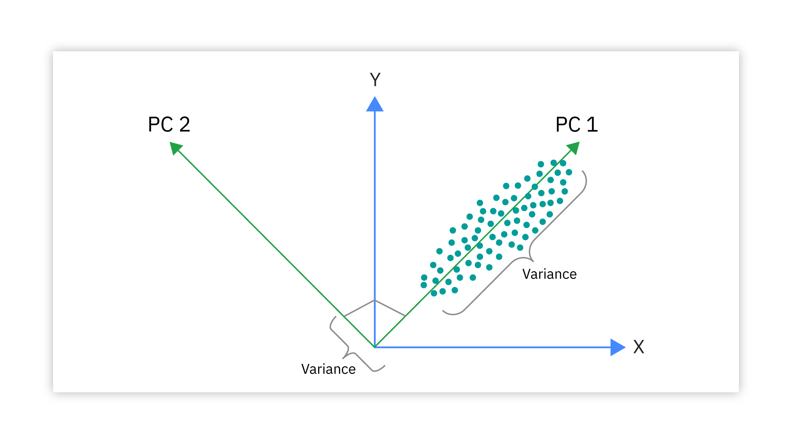
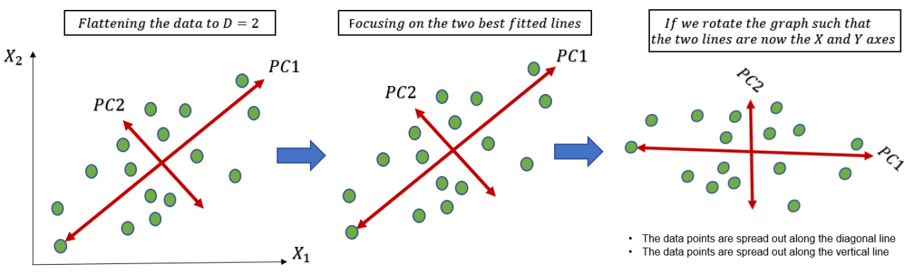

# Day_047 | Features Extraction | Principal Component Analysis | Feature Engineering

Principal Component Analysis (PCA) is a statistical method used to reduce the dimensionality of a dataset by transforming a large set of variables into a smaller set of "principal components" which capture the most significant variance within the data, essentially summarizing the key information while minimizing information loss; it is often used for data visualization and exploratory analysis by creating new, uncorrelated variables that represent the major patterns in the data. 

## Key points about PCA:
**1. Dimensionality reduction:**
The primary goal of PCA is to reduce the number of variables in a dataset while still retaining most of the important information. 

**2. Principal components:**
These are new variables created by taking linear combinations of the original variables, where the first principal component explains the most variance in the data, followed by the second, and so on. 

**3. Geometric interpretation:**
PCA can be visualized as rotating the data to a new coordinate system where the axes align with the directions of maximum variance. 

**4. Applications:**
PCA is widely used in various fields including machine learning, data science, image processing, genetics, and finance to identify patterns, visualize complex datasets, and perform feature selection. 

## How PCA works:
**1. Standardize the data:**
Each variable in the dataset is scaled to have a mean of zero and a standard deviation of one. 
**2. Calculate the covariance matrix:**
This matrix shows how the variables in the dataset are correlated with each other. 

**3. Find eigenvectors and eigenvalues:**
Eigenvectors represent the directions of maximum variance (principal components), while eigenvalues indicate the amount of variance explained by each principal component. 

**4. Project data onto principal components:**
Transform the original data onto the new coordinate system defined by the principal components. 

## What PCA Does:

1. Dimensionality Reduction: PCA reduces the number of features (dimensions) in a dataset.  

2. Variance Preservation: It identifies the principal components, which are new orthogonal (uncorrelated) axes that capture the maximum variance in the data.
      
3. Feature Extraction: PCA creates new features (principal components) that are linear combinations of the original features.  

4. Data Compression: It can be used to compress data by representing it with a smaller number of principal components.   

## How PCA Works:

**1. Standardization:**
- The data is standardized (mean = 0, standard deviation = 1) to ensure that features with larger scales don't dominate the analysis.   

**2. Covariance Matrix:**
- The covariance matrix is calculated, which shows the relationships between the original features. 
  
**3. Eigenvectors and Eigenvalues:**
   - The eigenvectors and eigenvalues of the covariance matrix are calculated.   
   - Eigenvectors represent the directions of maximum variance in the data.   
   - Eigenvalues represent the magnitude of the variance along the corresponding eigenvectors.   
  
**4. Selecting Principal Components:**
- The eigenvectors are sorted in descending order of their eigenvalues.   
- The top k eigenvectors (where k is the desired number of dimensions) are selected as the principal components.   
- The number of principle components selected is based on how much variance you wish to retain. Often a percentage of variance is selected, for example 95%.   

**5. Transforming the Data:**
- The original data is transformed into the new lower-dimensional space by projecting it onto the selected principal components.   


> Python
```python
import pandas as pd
import numpy as np
from sklearn.decomposition import PCA
from sklearn.preprocessing import StandardScaler

# Sample data
data = {'feature1': np.random.normal(0, 1, 100),
        'feature2': np.random.normal(0, 1, 100) + 2 * np.random.normal(0, 1, 100),
        'feature3': np.random.normal(0, 1, 100) - np.random.normal(0, 1, 100)}
df = pd.DataFrame(data)

# Standardize the data
scaler = StandardScaler()
scaled_data = scaler.fit_transform(df)

# Apply PCA
pca = PCA(n_components=2)  # Reduce to 2 dimensions
principal_components = pca.fit_transform(scaled_data)

# Create a DataFrame of principal components
principal_df = pd.DataFrame(data=principal_components, columns=['PC1', 'PC2'])

# Explained variance ratio
print("Explained variance ratio:", pca.explained_variance_ratio_)

print(principal_df.head())
```

## Images
1. 


2. 


3. 
