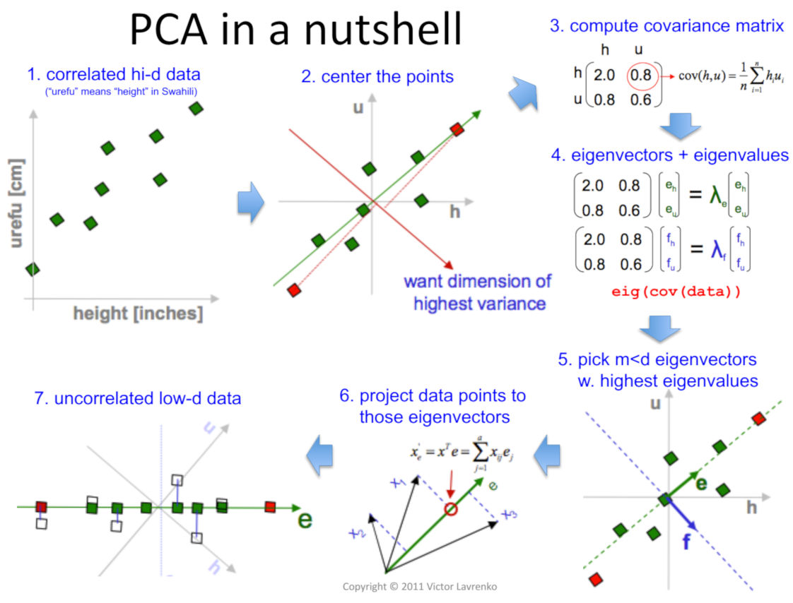

# Day_048 | Principal Component Analysis (PCA) | Feature Extraction | Feature Engineering
Principal component analysis (PCA) is a statistical procedure that reduces the number of variables in a dataset. It uses an orthogonal transformation to create new, uncorrelated variables called principal components. 

## Steps for calculating PCA 
1. Standardize the dataset
2. Subtract the mean of each variable
3. Calculate the covariance matrix
4. Calculate the eigenvalues and eigenvectors of the covariance matrix
5. Sort the eigenvectors by their corresponding eigenvalues in descending order
6. Select a subset of the eigenvectors
7. Recast the data along the principal components

## Other ways to calculate PCA 
1. Singular value `decomposition` of the data matrix
2. Eigenvalue approximation via power iterative computation
3. Non-linear iterative partial least squares (NIPALS) computation

## What do the eigenvalues and eigenvectors represent? 
**1. Eigenvalues:** Represent the magnitudes of the directions of the principal components

**2. Eigenvectors:** Represent the directions or components of the reduced subspace of the data

## Images
1. Main Image
   
2.

3.

4.
