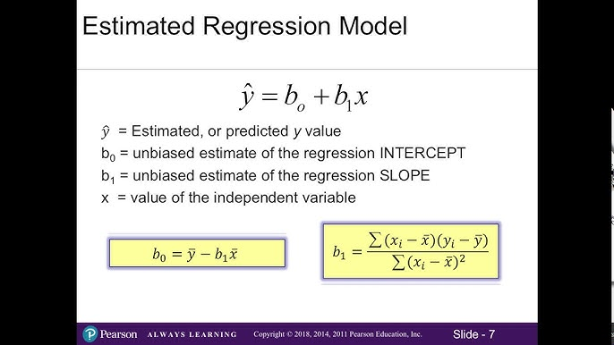
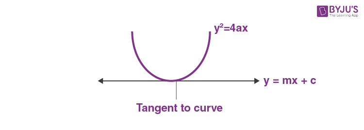
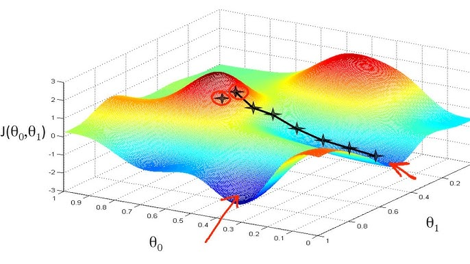
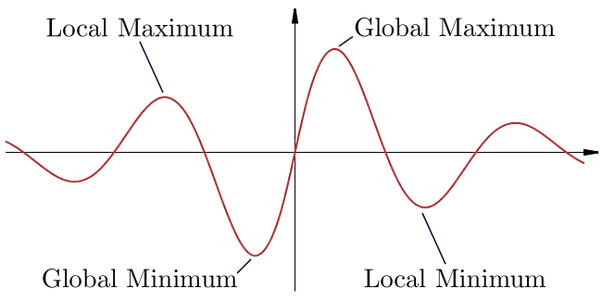
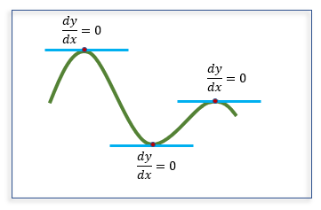
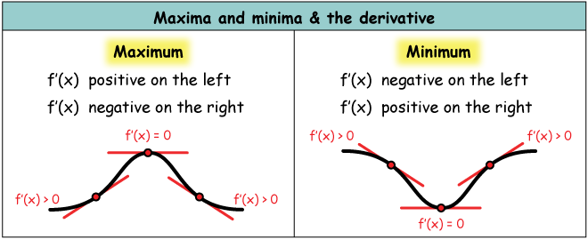

# Day 051 | Simple Linear Regression | Mathmetically find (m, c) | Custume Regression Algorithm
We can calculate (M, C) using 2 ways
1. Closed form (Direct math formula)
   1. Method: OLS (`LinearRegression`)
2. Non-Closed form (assumption)
   1. Gradiant Descent (`SGDRegression`)

# Error calculate

E = ∑ di2 
- Here d is basically y-y^
  - Here y is `should be` point
  - y ^ is `Prdicted/Estimate` point

E = ∑ (y-y^)2 
- Here, y^ is Prdicted point
  - y^ = mx+c

So E = ∑ (y-mx+c)2 

When C=0(constrant) 
E = ∑ (y-mx)2 

Here, X-axis = X, y-axis = E

Again, When m=1
E = ∑ (y-x+c)2 
Here, X-axis = X, y-axis = E

**Draw 3D curve**

Here,
- Low(Blue) point is Minimum Error
- High(Red) point is maximum Error

## From This curve and Equation apply Pertial Differentiation
In mathematics, "maxima and minima" refer to the highest and lowest points of a function, respectively. These points are also known as extrema.

**Equation**
Pertial Derivatives: f(x, y)
- ∂f/∂x
- ∂f/∂y

In my case, 
- f = E
- x = m
- y = c

### Partial Differentiation with respect to `c`
- ∂E/∂c = ∂/∂x &sum;(y-mx+c)2 = 0
-  &sum; 2(y-mx+c)(-1) = 0
-  &sum; -2(y-mx+c) = 0
-  &sum; y-mx+c = 0 
-  &sum;y/n - &sum;mx/n + &sum;c/n = 0 
-  y&#x304; - mx&#x304; + nc/n = 0
-  y&#x304; - mx&#x304; + c = 0
- **c = y&#x304; - mx&#x304; (ans)**

Put this `c` value in `E`
- E = ∑ (y-mx+c)2 
- E = ∑ (y-mx-y&#x304; - mx&#x304;)2 

### Partial Differentiation with respect to `m`
- ∂E/∂c = ∂/∂x ∑ (y-mx-y&#x304; - mx&#x304;)2 = 0
- ∑ 2(y-mx-y&#x304; - mx&#x304;)(-x + x&#x304;) = 0
- ∑ -2(y-mx-y&#x304; - mx&#x304;)(x - x&#x304;) = 0
- ∑ (y-mx-y&#x304; - mx&#x304;)(x - x&#x304;) = 0
- ∑ [ (y-y&#x304;) -m(x - x&#x304;) ] (x - x&#x304;) = 0
- ∑ (y-y&#x304;)(x - x&#x304;) - m(x - x&#x304;)2 = 0
- ∑ m(x - x&#x304;)2 = ∑ (y-y&#x304;)(x - x&#x304;) 
- **m = ∑ (y-y&#x304;)(x - x&#x304;)/∑ (x - x&#x304;)2 (ans)**

**Here**,
  - `X` is Features(Input) (X1, X2 ... Xn)
  - `Y` is Label(Output) (Y1, Y2 ... Yn)
  - `M` is constrant `slop`.
  - `C` is constrant `intercept`.

