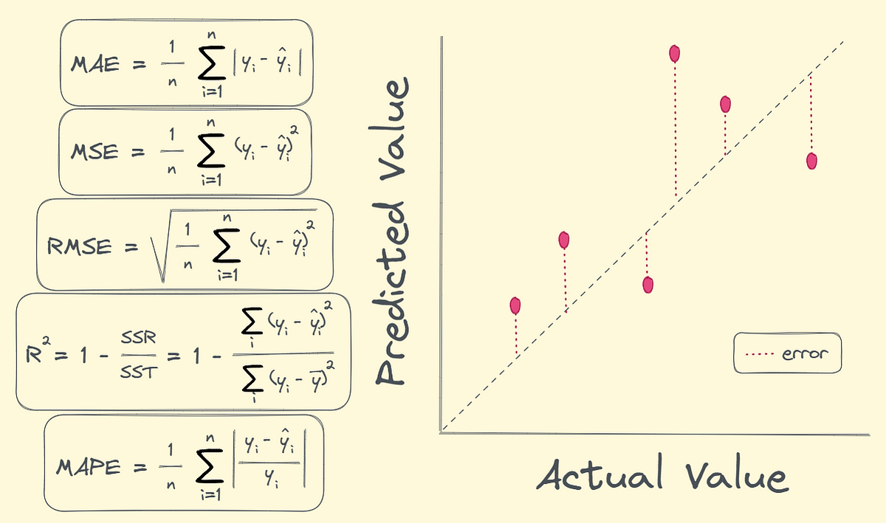

# Day 052| Regression Metrics 
Regression metrics are used to evaluate the performance of regression models, which predict continuous numerical values

## Types of Regression Metrics
1. Mean Absolute Error (MAE)
2. Mean Squared Error (MSE)
3. Root Mean Squared Error (RMSE)
4. R-squared (R²)
5. Adjusted R-squared
6. Median Absolute Error (MedAE)
   
## Explaination
1. **Mean Absolute Error (MAE)**
    - Definition: The average of the absolute differences between the predicted and actual values.
    - Formula: `MAE = (1/n) * Σ |yᵢ - ŷᵢ|`
        - `n`: Number of data points
        - `yᵢ`: Actual value
        - `ŷᵢ`: Predicted value
    - Interpretation: Lower MAE values indicate better model performance. It's easy to interpret as it's in the same units as the target variable.
    - Sensitivity to Outliers: Less sensitive to outliers compared to MSE.

2.  **Mean Squared Error (MSE)**
    - **Definition:** The average of the squared differences between the predicted and actual values.
    - **Formula:** `MSE = (1/n) * Σ (yᵢ - ŷᵢ)²`
    - **Interpretation:** Lower MSE values indicate better model performance. It penalizes larger errors more heavily than MAE due to the squaring.
    - **Sensitivity to Outliers:** Highly sensitive to outliers.


3.  **Root Mean Squared Error (RMSE)**
    - **Definition:** The square root of the MSE.
    - **Formula:** `RMSE = √MSE`
    - **Interpretation:** Lower RMSE values indicate better model performance. It's in the same units as the target variable, making it easier to interpret compared to MSE.
    - **Sensitivity to Outliers:** Highly sensitive to outliers.

4.  **R-squared (R²)**
    - **Definition:** Measures the proportion of the variance in the dependent variable that is predictable from the independent variables.
    - **Formula:** `R² = 1 - (SSres / SStot)`
      - **SSres**: Sum of squared residuals `(Σ (yᵢ - ŷᵢ)²)`
      - **SStot:** Total sum of squares `(Σ (yᵢ - ȳ)²)`
      - **ȳ:** Mean of actual values
    - **Interpretation:**
        - R² ranges from 0 to 1.
        - 1 indicates a perfect fit.
        - 0 indicates that the model doesn't explain any variance.
        - Values closer to 1 indicate better model performance.
    - **Limitations:** R² can increase with the addition of more predictors, even if they are not relevant.

5.  **Adjusted R-squared**
    - **Definition:** A modified version of R² that penalizes the addition of irrelevant predictors.
    - **Formula:** Adjusted `R² = 1 - [(1 - R²) * (n - 1) / (n - p - 1)]`
      + n: Number of data points
      + p: Number of predictors
    - **Interpretation:**
        + Adjusted R² accounts for the number of predictors, providing a more accurate assessment of model fit.
        + It can decrease if irrelevant predictors are added.

6.  **Median Absolute Error (MedAE)**
    - **Definition:** The median of the absolute differences between the predicted and actual values.
    - **Formula**: `MedAE = median(|yᵢ - ŷᵢ|)`
    - **Interpretation:** Lower MedAE values indicate better model performance. It's robust to outliers.
    - **Sensitivity to Outliers:** Very robust to outliers.

## Python Implementation (scikit-learn)
> Python
```Python
from sklearn.metrics import mean_absolute_error, mean_squared_error, r2_score
import numpy as np

# Sample actual and predicted values
y_true = np.array([3, -0.5, 2, 7])
y_pred = np.array([2.5, 0.0, 2, 8])

# Calculate metrics
mae = mean_absolute_error(y_true, y_pred)
mse = mean_squared_error(y_true, y_pred)
rmse = np.sqrt(mse)
r2 = r2_score(y_true, y_pred)

print(f"MAE: {mae}")
print(f"MSE: {mse}")
print(f"RMSE: {rmse}")
print(f"R-squared: {r2}")

from sklearn.metrics import median_absolute_error
medae = median_absolute_error(y_true, y_pred)
print(f"MedAE: {medae}")
```

## Choosing the Right Metric:
- **MAE:** Use when you want a metric that's easy to interpret and less sensitive to outliers.
- **MSE/RMSE:** Use when you want to penalize larger errors more heavily. RMSE is preferred when you want the error in the same units as the target variable. Be aware of the impact of outliers.
- **R²:** Use when you want to understand the proportion of variance explained by the model. Be cautious when adding more predictors.
- **Adjusted R²:** Use when you want to account for the number of predictors and penalize the addition of irrelevant ones.
- **MedAE:** Use when your data contains many outliers, and you need a robust metric.

