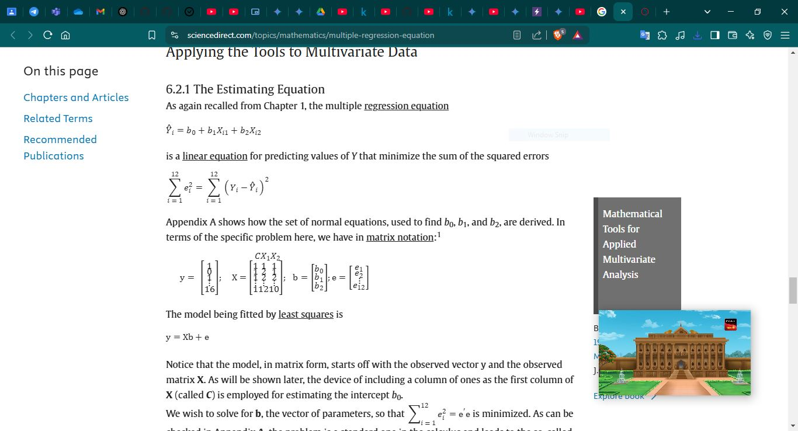
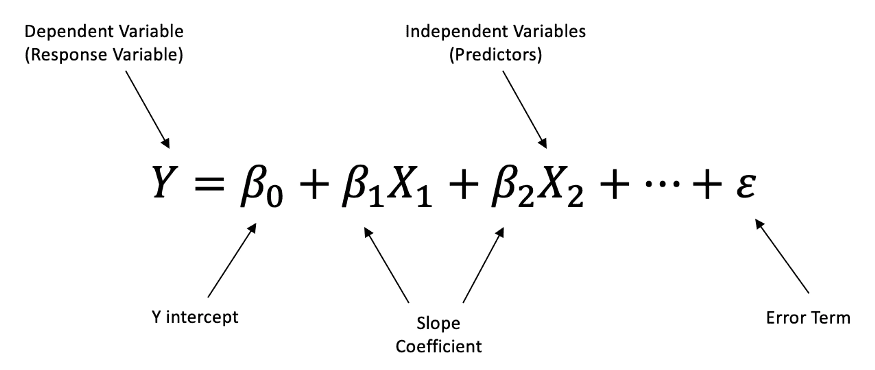

# Day 054 | Multiple Linear Regression | Mathematical Formula Proved

The mathematical formulas used in multiple linear regression are derived using the method of least squares. This method aims to find the coefficients (β) that minimize the sum of squared errors between the observed and predicted values. 

## 1. Model Representation:
We represent the multiple linear regression model in matrix form: `y = Xβ + ε`  
- Where:
    - y: The response vector (n x 1).   
    - X: The design matrix (n x (p+1)), where n is the number of observations and p is the number of predictors.
    - β: The coefficient vector ((p+1) x 1).
    - ε: The error vector (n x 1).

## 2. Objective Function (Sum of Squared Errors):
We want to minimize the `sum of squared errors (SSE)`, which is defined as:
- `SSE = εᵀε`
- Substituting `ε = y - Xβ`, we get:
- SSE = `(y - Xβ)ᵀ(y - Xβ)`

## 3. Expanding the Equation:
Expanding the equation, we get:
- `SSE = (yᵀ - βᵀXᵀ)(y - Xβ)`
- `SSE = yᵀy - yᵀXβ - βᵀXᵀy + βᵀXᵀXβ`  
Since βᵀXᵀy is a scalar, it's equal to its transpose (yᵀXβ). Therefore:
- `SSE = yᵀy - 2βᵀXᵀy + βᵀXᵀXβ`

## 4. Minimizing SSE (Taking the Derivative):
To find the β that minimizes SSE, we take the derivative of SSE with respect to β and set it to zero:
- `∂(SSE)/∂β = -2Xᵀy + 2XᵀXβ = 0`

## 5. Solving for β:
Rearranging the equation, we get:
- `2XᵀXβ = 2Xᵀy`
- `XᵀXβ = Xᵀy`  
Multiplying both sides by (XᵀX)⁻¹ (the inverse of XᵀX), we get:
- `(XᵀX)⁻¹XᵀXβ = (XᵀX)⁻¹Xᵀy` <nr>
Since (XᵀX)⁻¹XᵀX is the identity matrix, we have:
-  **β = (XᵀX)⁻¹Xᵀy** 

## Assumptions and Conditions:

- **`XᵀX` is invertible:** This requires that the columns of X are linearly independent (no perfect multicollinearity).
- **Errors are normally distributed with constant variance:** This is often assumed for statistical inference (hypothesis testing).   
- **Errors have zero mean:** This is a standard assumption in linear regression.
- **Errors are independent:** This means that the error for one observation is not related to the error for another observation.

## Significance of the Formula:
- The formula `β = (XᵀX)⁻¹Xᵀy` provides the least squares estimates of the regression coefficients.
- It is derived by minimizing the sum of squared errors, which is a common and intuitive approach to fitting a model to data.
- It is a closed-form solution, meaning that it directly calculates the coefficients without requiring iterative optimization.

