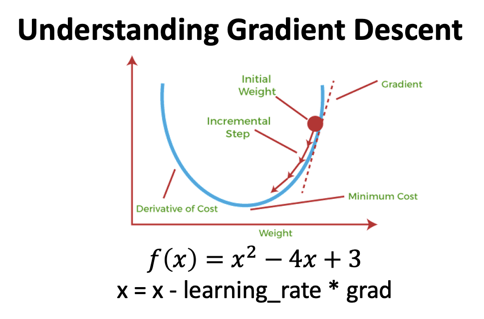
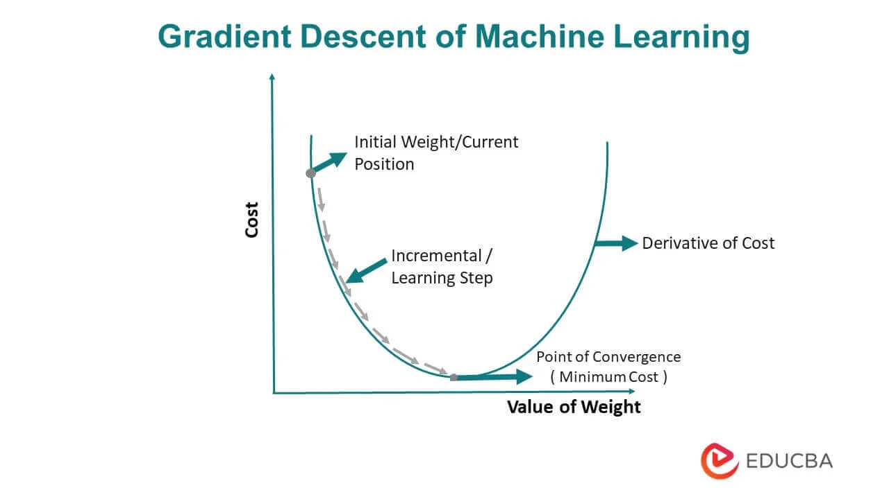
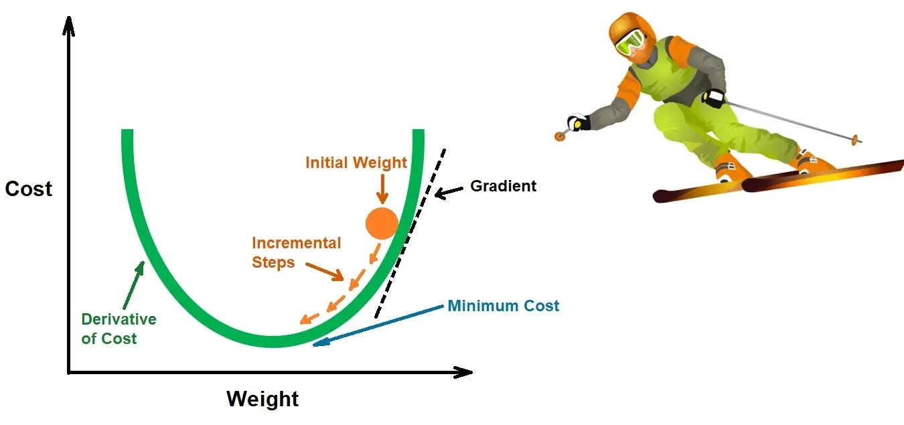

# Day 056 | Gradient Descent 
Gradient descent is a mathematical algorithm that finds the lowest value of a function. It's often used to train machine learning models and neural networks

In machine learning, "gradient descent" is an optimization algorithm used to train models by iteratively adjusting their parameters (like weights and biases) in the direction that minimizes a cost function, essentially moving the model closer to the "best" solution by taking steps opposite to the gradient of the error at each iteration, aiming to find the set of parameters that produce the most accurate predictions on the training data.

## Goal:
To find the minimum value of a cost function, which represents the error between the model's predictions and the actual target values

## How it works 
1. Start with a random input
2. Find the direction in which the function decreases the most
3. Take a small step in that direction
4. Repeat until the function is close to or equal to zero
 

## Gradient Descent Mathematical Low
Loss function of 2D L(m, c)<br>
- L = $\sum_{i=1}^{n}(y_i-ŷ)^2$
- L = $\sum_{i=1}^{n}(y_i - mx_i - c)^2$
- L(m, c)

Find the minimum value for this Loss function of 2 parameter. 
Here I should apply `Partial Derivatives` for solve this function with respect to `m` and `c`

**1. `L` with respect to `c`**
- $\frac {δL}{δc}$= -2 $\sum_{i=1}^{n}(y_i - mx_i -c)$

**2. `L` with respect to `m`**
- $\frac {δL}{δm}$= -2 $\sum_{i=1}^{n} x_i(y_i - mx_i -c)$

These $\frac {δL}{δc}$ and $\frac {δL}{δm}$ are the `Slope` of that function
- Change the value of `m` and `c`, get the minima for this function

**1. Update `C`**
- $\ C_n$ = $\ C_o$ - $\eta$ x Slope
- Here,
  - $\ C_n$ = new `C`
  - $\ C_o$ = old `C`

**M. Update `M`**
- $\ M_n$ = $\ M_o$ - $\eta$ x Slope
- Here,
  - $\ M_n$ = new `M`
  - $\ M_o$ = old `M`


## Important factors:
1. **Learning rate:** Controls the size of the steps taken during parameter updates. A small learning rate may take longer to converge, while a large one might overshoot the minimum. 
2. **Cost function:** The chosen function that measures the error between predictions and actual values. 

## Variants of gradient descent:
1. **Batch gradient descent:** Calculates the gradient over the entire training set at each iteration. 
2. **Stochastic gradient descent (SGD):** Updates parameters based on a single data point at each iteration, which can be faster for large datasets. 
3. **Mini-batch gradient descent:** Uses a small batch of data points to calculate the gradient, balancing between efficiency and stability. 

## Applications:
Training linear regression models, Training logistic regression models, and Training neural networks. 

## Limitations:
1. **Local minima:** Gradient descent can get stuck in a local minimum where the cost function is not globally minimized. 
2. **Sensitivity to learning rate:** Choosing an inappropriate learning rate can lead to slow convergence or failure to find the optimal solution. 
3. **Computational cost:** Can be slow for very large datasets.

## Implementation using Python
>Python

```Python
class FullGDRegression:
  def __init__(self, lr, epochs) -> None:
    self.m = 1
    self.c = 0

    self.coef_ = self.m
    self.intercept_ = self.c

    self.lr = lr
    self.epochs = epochs

  def fit(self, X, y):

    for i in range(self.epochs):
      # loss_slope = -2 sum (y-mx-c)
      loss_slope_c = -2 * np.sum(y - self.m *X.ravel()- self.c)
      loss_slope_m = -2 * np.sum(X.ravel() * (y - self.m*X.ravel() - self.c))

      # update m and c
      self.c = self.c - (self.lr * loss_slope_c)
      self.m = self.m - (self.lr * loss_slope_m)
      # print(loss_slope, c)
      print(self.m, self.c)

  def predict(self, X):
    return X*self.m + self.c
```

## Images



