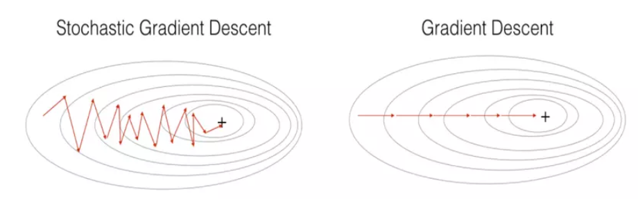
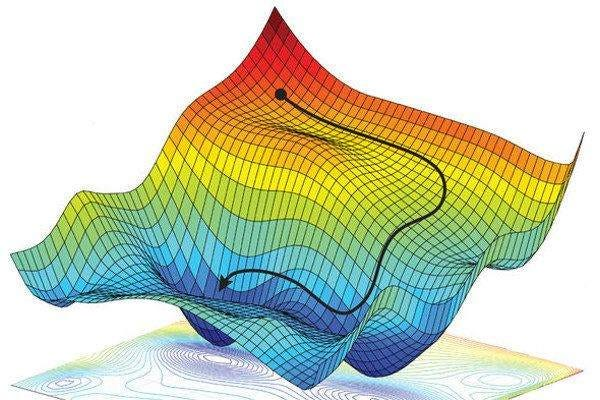

# Day 58 | Stochastic Gradient Descent
Stochastic Gradient Descent (SGD) is a machine learning optimization algorithm that updates model parameters iteratively using a small subset (or even a single) of the training data, making it computationally efficient, especially for large datasets.

## What it is:
SGD is a variant of the gradient descent algorithm, a common method for minimizing a loss function in machine learning. Unlike traditional gradient descent, which uses the entire dataset to calculate the gradient and update parameters, SGD updates parameters using only a small batch (or a single data point) at a time.

## Why it's used:
- **Computational Efficiency:** SGD is faster than traditional gradient descent, especially for large datasets, because it processes data in smaller chunks. 
- **Scalability:** Its ability to handle large datasets makes it suitable for real-world machine learning problems. 
- **Online Learning:** SGD can be used in scenarios where data arrives sequentially (online learning), allowing models to be updated continuously as new data comes in. 

## How it works:
- **Initialization:** Start with an initial set of model parameters. 
- **Iterative Updates:**
    - For each iteration, randomly select a small batch (or a single data point) from the training data. 
    - Calculate the gradient of the loss function with respect to the model parameters using the selected batch. 
    - Update the model parameters by moving in the opposite direction of the calculated gradient. 
- **Repeat:** Repeat steps 2 until the model converges to a satisfactory solution. 

## Advantages:
- **Faster Convergence:** SGD updates parameters more frequently, potentially leading to faster convergence, especially for large datasets. 
- **Reduced Computation Time:** SGD processes data in smaller batches, reducing the computational cost per iteration. 
- **Potential to Escape Local Minima:** The stochastic nature of SGD, with its random updates, can help the algorithm escape local minima and potentially find better solutions. 

## Disadvantages:
- **Noisy Convergence:** The convergence path of SGD can be noisier than that of traditional gradient descent, as it's based on a stochastic approximation of the gradient. 
- **Parameter Tuning:** SGD can be sensitive to the learning rate and other hyperparameters, requiring careful tuning. 

## Variants:
There are several variants of SGD, such as mini-batch SGD, which uses small batches of data, and SGD with momentum, which uses the previous update to guide the current update. 

## Mathematics Calculation
It's calculation with single row

- <span style="color:yellow;">**$\beta_0$ = $-2(y_i-\hat{y_i})$**</span>

- <span style="color: #01cce9;">**$\beta_m$ = $-2(y_i-\hat{y_i})X_i$**

## Code Implementation
> Python3
```python
class SGDRegressorCustom:
    def __init__(self, learning_rate=0.01, epochs=100):
        self.coef_ = None
        self.intercept_ = None
        self.lr = learning_rate
        self.epochs = epochs

    def fit(self, X_train, y_train):
        self.intercept_ = 0
        self.coef_ = np.ones(X_train.shape[1])

        for i in range(self.epochs):

          for j in range(X_train.shape[0]):

            # find the intercept (c)
            idx = np.random.randint(0, X_train.shape[0])
            y_hat = np.dot(X_train[idx], self.coef_) + self.intercept_

            intercept_der = -2 * (y_train[idx] - y_hat)
            self.intercept_ = self.intercept_ - (self.lr * intercept_der)

            # find the coef
            coef_der = -2 * np.dot((y_train[idx] - y_hat), X_train[idx])
            self.coef_ = self.coef_ - (self.lr * coef_der)


    def predict(self, X_test):
        return np.dot(X_test, self.coef_) + self.intercept_
```

## Images

