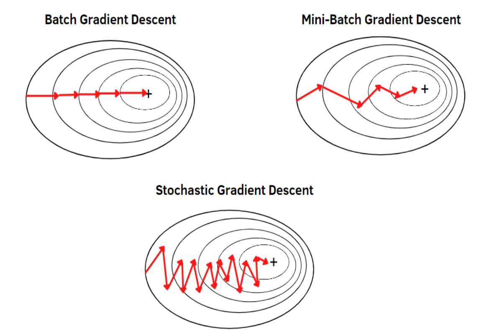
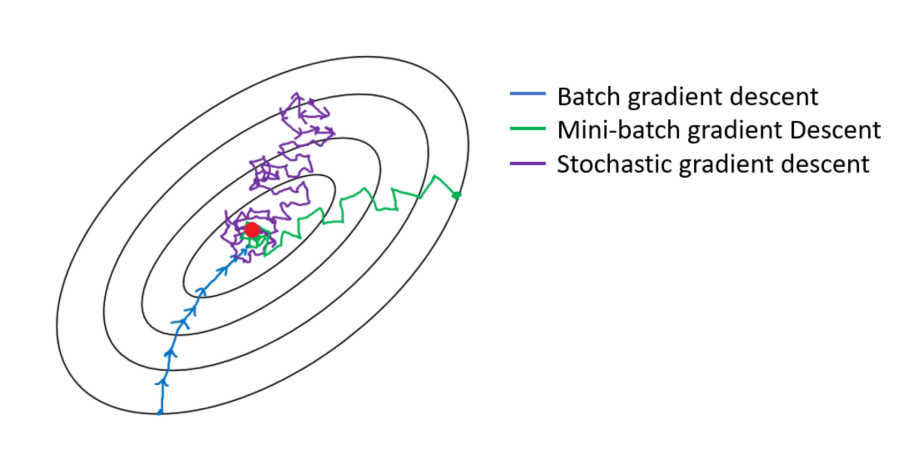

# Day 059 | Mini Batch Gradient Descent
Mini-batch gradient descent is a variant of gradient descent that updates model `parameters using small`, `random subsets (mini-batches)` of the training data, offering a balance between the efficiency of batch gradient descent and the robustness of stochastic gradient descent. 

## What it is:
Mini-batch gradient descent is an optimization algorithm used to find the minimum of a cost function in machine learning problems. Unlike batch gradient descent, which uses the entire dataset to calculate gradients, mini-batch gradient descent uses smaller, randomly selected subsets of the data. 

## How it works:
- The training data is divided into `smaller batches`. 
- For each batch, the model calculates the gradient of the `cost function` with respect to the model parameters. 
- The model then `updates its parameters` using the calculated gradients. 
- This process is `repeated for multiple batches` until the model converges to a minimum of the cost function. 

## Advantages:
- **Faster convergence:** Mini-batch gradient descent can converge faster than batch gradient descent, especially for large datasets, because it updates the parameters more frequently. 
- **Better generalization:** The use of mini-batches can help the model to generalize better to unseen data, as it is exposed to a wider variety of data during training. 
- **Scalability:** Mini-batch gradient descent is well-suited for large datasets, as it can process the data in smaller chunks. 

## Disadvantages:
- **Hyperparameter tuning:** The size of the mini-batch is a hyperparameter that needs to be tuned, which can be time-consuming. 
- **Computational overhead:** Calculating gradients for each mini-batch can be computationally expensive, especially for large datasets. 

## Relationship to other gradient descent methods:
- **Batch gradient descent:** Uses the entire dataset to calculate gradients, resulting in slower convergence but potentially more stable updates. 
- **Stochastic gradient descent (SGD):** Uses a single data point to calculate gradients, resulting in faster convergence but potentially more noisy updates. 
- **Mini-batch gradient descent:** MBGD is a compromise between batch and stochastic gradient descent, offering a balance between speed and stability. 

## Implementation:
In frameworks like TensorFlow and PyTorch, mini-batch gradient descent is typically implemented by specifying the batch_size parameter when training a model. 

> Python
```python
class MiniBatchRegressor:
  def __init__(self, lr=0.01, epochs=100, batch_size=10) -> None:
    
    self.coef_ = None
    self.intercept_ = None
    self.lr = lr
    self.epochs = epochs
    self.batch_size = batch_size
  
  def fit(self, X_train, y_train):
    self.intercept_ = 0
    self.coef_ = np.ones(X_train.shape[1])

    for i in range(self.epochs):
      for j in range(int(X_train.shape[0]/self.batch_size)):
         idx = random.sample(range(X_train.shape[0]),self.batch_size)
         y_hat = np.dot(X_train[idx], self.coef_) + self.intercept_
         intercept_der = -2 * np.mean(y_train[idx] - y_hat)
         self.intercept_ = self.intercept_ - (self.lr * intercept_der)

         coef_der = -2 * np.dot((y_train[idx] - y_hat), X_train[idx])
         self.coef_ = self.coef_ - (self.lr * coef_der)
  
  def predict(self, X_test):
    return np.dot(X_test, self.coef_) + self.intercept_
```

## Images

