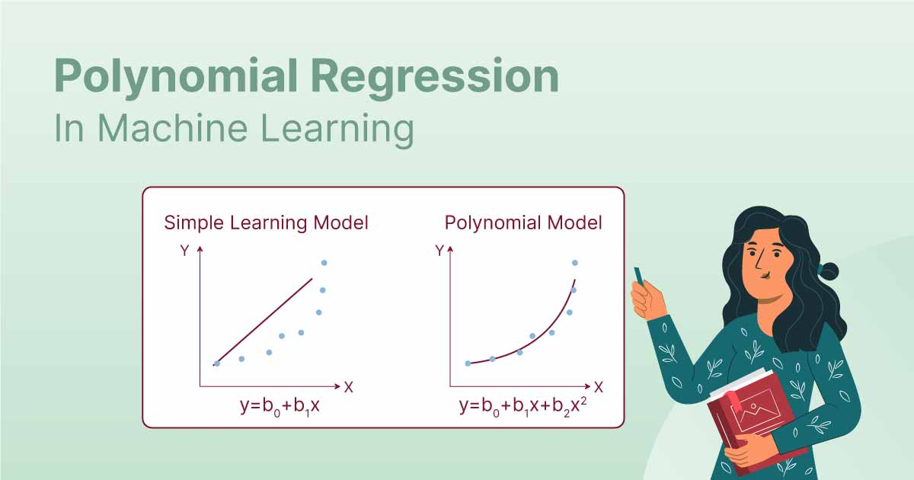
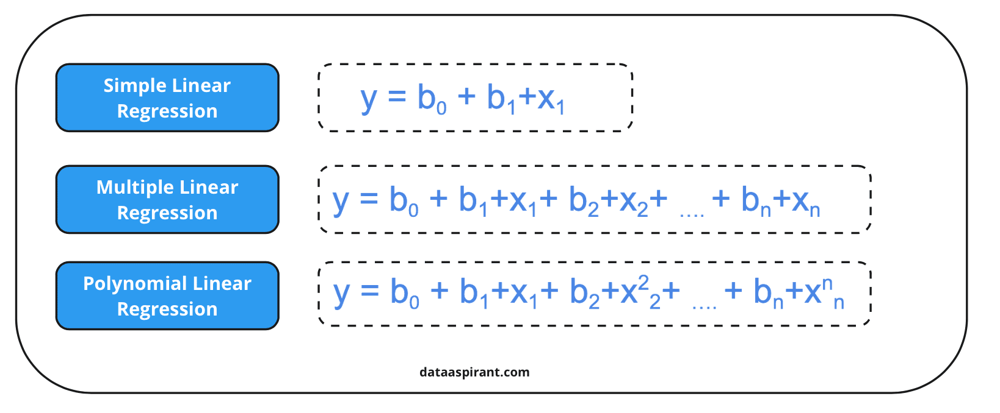
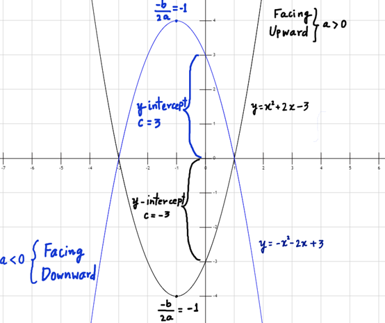

# Day 60 | Polynomial Regression

Polynomial regression in machine learning is an extension of linear regression that models non-linear relationships between variables by fitting a polynomial equation to the data, allowing for curved patterns to be captured. 

## What it is:
Polynomial regression is used when the relationship between the independent variable (x) and the dependent variable (y) cannot be accurately represented by a straight line (as in linear regression), but instead follows a `curve`.

## How it works:
It models the relationship as an `nth-degree polynomial`, meaning it fits a `curve to the data points`, rather than a straight line.

## When to use it:
When you observe a `non-linear relationship` in your data, and a straight line doesn't accurately capture the pattern, polynomial regression is a suitable alternative. 

## Example:
Imagine you have data showing that as time (x) increases, the value of something (y) first increases rapidly, then slows down and eventually plateaus. A straight line wouldn't fit this, but a polynomial curve could. 

## Advantages:
- Can model complex, non-linear relationships. 
- Can lead to more accurate predictions than linear regression when the data is non-linear. 

## Disadvantages:
- **Overfitting:** Higher-degree polynomials can fit the training data too closely, including noise, leading to poor performance on new data. 
- **Model Complexity:** Choosing the right degree of the polynomial can be challenging, and a model that is too complex can be difficult to interpret. 

## How to choose the right degree:
The degree of the polynomial should be chosen based on the complexity of the data and the curve pattern observed. 

## Relationship to Linear Regression:
Polynomial regression is a form of linear regression where the `independent variables are transformed into polynomial terms`. 

## Applications:
Polynomial regression finds applications in diverse fields such as finance, biology, and physics, where patterns are often non-linear. 

## Implementation Code
> Python
```python
def polynomial_regression(degree):
    plt.figure(figsize=(10,5))
    X_new=np.linspace(-3, 3, 100).reshape(100, 1)
    X_new_poly = poly.transform(X_new)

    polybig_features = PolynomialFeatures(degree=degree, include_bias=False)
    std_scaler = StandardScaler()
    lin_reg = LinearRegression()
    polynomial_regression = Pipeline([
            ("poly_features", polybig_features),
            ("std_scaler", std_scaler),
            ("lin_reg", lin_reg),
        ])
    polynomial_regression.fit(X, y)
    y_newbig = polynomial_regression.predict(X_new)
    plt.plot(X_new, y_newbig,'r', label="Degree " + str(degree), linewidth=2)

    plt.plot(X_train, y_train, "b.", linewidth=3)
    plt.plot(X_test, y_test, "g.", linewidth=3)
    plt.legend(loc="upper left")
    plt.xlabel("X")
    plt.ylabel("y")
    # plt.axis([-3, 3, 0, 10])
    plt.show()
```

## Images



