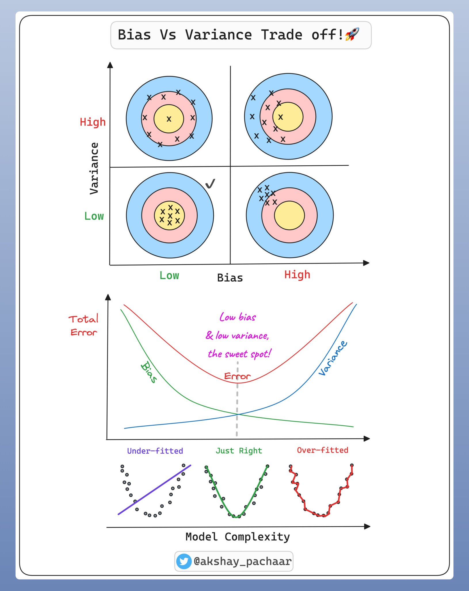
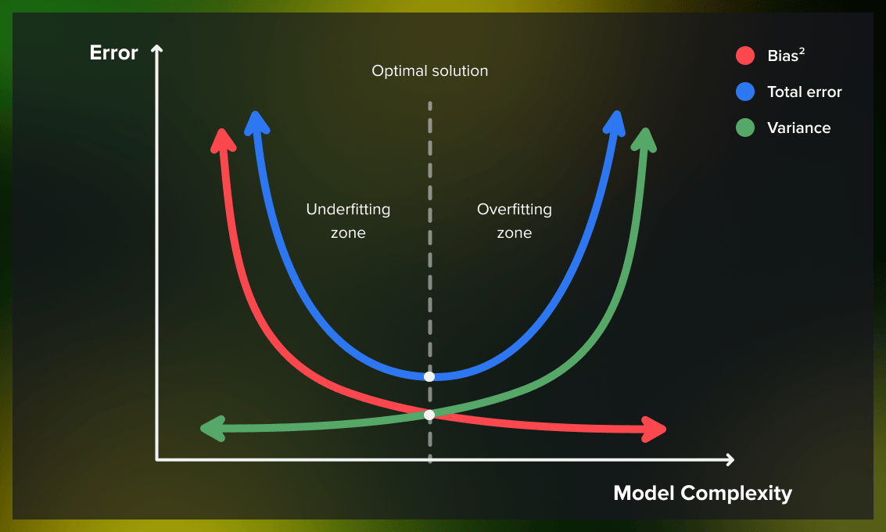

# Day 61 | Bias-Variance Trade off
The bias-variance tradeoff in machine learning refers to the inherent tension between a model's ability to fit the training data well (low bias) and its ability to generalize to unseen data (low variance). The goal is to find the optimal model complexity that minimizes both bias and variance, preventing underfitting and overfitting. 

## Bias:
Refers to the error introduced by a model making simplifying assumptions about the data, which can lead to underfitting. 
- **High Bias:** A model with high bias is `too simple` and cannot capture the underlying patterns in the data, resulting in poor performance on both training and test data. 
- **Low Bias:** A model with low bias can capture `complex relationships` in the data, but may overfit to the training data, resulting in `high variance`. 

## Variance:
Represents the model's sensitivity to small fluctuations in the training data, which can lead to overfitting. 
- **High Variance:** A model with high variance is too `complex` and learns the noise in the training data, resulting in `poor performance on unseen data`. 
- **Low Variance:** A model with low variance is stable and generalizes well to unseen data, but may be too `simple and underfit` the training data. 

## The Tradeoff:
As model complexity increases, `bias tends to decrease` (the model can fit the training data better), but `variance tends to increase` (the model becomes more sensitive to the training data). Conversely, as model complexity decreases, variance tends to decrease (the model becomes more stable), but bias tends to increase (the model may not be able to capture the underlying patterns in the data). 

## Finding the Right Balance:
The goal is to find the sweet spot where `both bias and variance are minimized`, resulting in a model that generalizes well to unseen data. This often involves techniques like regularization, cross-validation, and choosing the right model complexity.

> Bias: Low
> 
> Variance: Low

## Underfitting vs Overfitting:
- **Underfitting:** Occurs when a model is `too simple` and cannot capture the underlying patterns in the data, resulting in `high bias and high error` on both training and test data. 
- **Overfitting:** Occurs when a model is too `complex` and learns the noise in the training data, resulting in `high variance and high error` on test data, although it performs well on the training data. 

## Images

