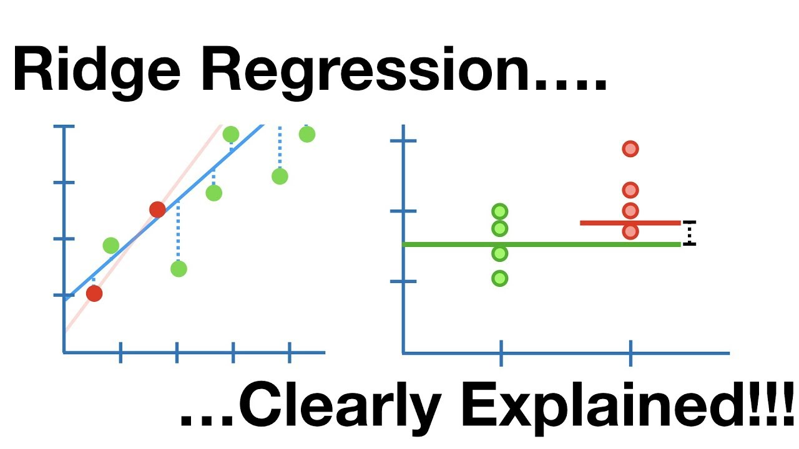

# Day 062 | Ridge Regression part 1
Ridge regression, also known as L2 regularization, is a technique used in linear regression to address multicollinearity and reduce overfitting by adding a penalty term to the cost function, shrinking coefficients towards zero without eliminating any. 

## Addressing Multicollinearity:
When independent variables in a regression model are highly correlated (multicollinearity), the standard least squares estimates can become unstable and unreliable. Ridge regression mitigates this by penalizing large coefficients, effectively shrinking them towards zero but not to zero, which helps stabilize the model and improve the reliability of coefficient estimates. 

## L2 Regularization:
Ridge regression employs L2 regularization, which adds a penalty term to the cost function that is proportional to the square of the coefficients. This penalty discourages large coefficients, leading to a more stable and robust model. 

## Shrinking Coefficients:
The penalty term in ridge regression shrinks the coefficients towards zero, but unlike Lasso regression (L1 regularization), it doesn't force any coefficients to become exactly zero. This means that all features remain in the model, but with reduced influence. 

## Benefits:
- **Reduces Overfitting:** By shrinking coefficients, ridge regression reduces the model's complexity and improves its ability to generalize to new, unseen data. 
- **Handles Multicollinearity:** Ridge regression effectively addresses multicollinearity by penalizing large coefficients, leading to more stable and reliable coefficient estimates. 
- **Improves Model Stability:** The penalty term in ridge regression makes the model less sensitive to changes in the input data, leading to a more stable and robust model. 

## Mathematical Intuition:
The ridge regression objective function includes a penalty term (λ * Σ(βj^2)) where λ is a tuning parameter that controls the strength of the penalty and βj are the coefficients. 

## When to use:
Ridge regression is particularly useful when dealing with datasets that have:
- Many features relative to the number of observations. 
- Highly correlated independent variables. 
- A need for a more robust and stable model. 

## Summary
In summary, ridge regression is a powerful tool for improving the stability and generalization ability of linear regression models, especially in scenarios with multicollinearity and a high risk of overfitting.

## Images
