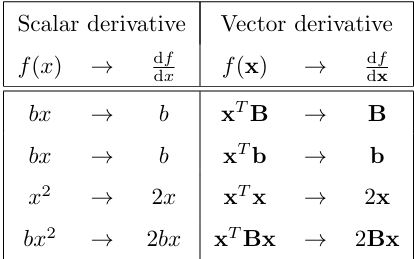

# Day 63 | Ridge Regression Mathematical Formula and Code
Ridge regression is a statistical regularization technique. It corrects for overfitting on training data in machine learning models.

##  Mathematical Prove
Loss function for Linear Regression
- Loss Function L = $\sum_{i=1}^{n} (y_i-\hat{y_i})^2$
- $\hat{y_i} = mx_i - c$
- c = $\bar{y} - m \bar{x}$

<!-- - $\frac {δL}{δ\beta_0}$ = $\frac{1}{m}$ $[2*(y_1-\hat{y_1})(-1) + 2(y_2-\hat{y_2})(-1)]$ -->

Loss function for Ridge Regression
- Loss Function L = $\sum_{i=1}^{n} (y_i-\hat{y_i})^2 + \gamma m^2$
- Loss Function L = $\sum_{i=1}^{n} (y_i - m x_i - c)^2 + \gamma m^2$
- Loss Function L = $\sum_{i=1}^{n} (y_i - m x_i - \bar{y} - m \bar{x})^2 + \gamma m^2$

Derivatives this with respect to `m`
- L = $\sum_{i=1}^{n} (y_i - m x_i - \bar{y} - m \bar{x})^2 + \gamma m^2$
- $\frac {δL}{δm}$ = $2\sum(y_i - m x_i - \bar{y} - m \bar{x})(-x_i + \bar{x}) + 2\gamma m$
- $\frac {δL}{δm}$ = $-2\sum(y_i - m x_i - \bar{y} - m \bar{x})(x_i - \bar{x}) + 2\gamma m$

Now this equation will be `0` for find the `minima` slop
- $-2\sum(y_i - m x_i - \bar{y} - m \bar{x})(x_i - \bar{x}) + 2\gamma m$ = $0$
- $-\sum(y_i - m x_i - \bar{y} - m \bar{x})(x_i - \bar{x}) + \gamma m$ = $0$
- $\gamma m -\sum(y_ - m x_i - \bar{y} - m \bar{x})(x_i - \bar{x})$ = $0$

- $\gamma m -\sum[(y_i- \bar{y}) - m (x_i - \bar{x})](x_i - \bar{x})$ = $0$
- $\gamma m -\sum[(y_i- \bar{y})(x_i - \bar{x}) - m (x_i - \bar{x})^2]$ = $0$
- $\gamma m -\sum(y_i- \bar{y})(x_i - \bar{x}) +\sum m (x_i - \bar{x})^2$ = $0$
- $\gamma m +\sum m (x_i - \bar{x})^2$ = $\sum(y_i- \bar{y})(x_i - \bar{x})$
- $m (\gamma +\sum (x_i - \bar{x})^2)$ = $\sum(y_i- \bar{y})(x_i - \bar{x})$
- <span style="color:#54ff82"> $m$ = $\frac{\sum(y_i- \bar{y})(x_i - \bar{x})}{\sum (x_i - \bar{x})^2 + \gamma }$ </span>
- <span style="color:#f654ff"> $m ∝ \frac{1}{X}$ </span>

When I increase $\gamma$ then `m` descrease. This relationship is  `inverse variation`. If $\gamma$ = 0 then it will be `Linear Regression`

## For N-Dim 
- Simple Loss function = $\sum (y_i - \hat{y_i})^2$
- N-Dim Loss Function = $\sum (XW - Y)^T (XW-Y)$
- Here,
  - W = $\begin{bmatrix} \omega_1 \\\ \omega_2 \\\ ... \\\ \omega_n \end{bmatrix}$
  - Y = $\begin{bmatrix} y_1 \\ y_2 \\\ ... \\\ y_m \end{bmatrix}$
  -  X = $\begin{bmatrix}1 &x11 &x12 &x13 &... &x1n\\ 1 &x21 &x22 &x23 &... &x2n\\ 1 &... &... &... &... &... \\ 1 &xm1 &xm2 &xm3 &... &xmn \end{bmatrix}$

Now, for Ridge Regression,
- L = = $(XW - Y)^T (XW-Y) +\lambda ||W||^2$
- L = = $(XW - Y)^T (XW-Y) +\lambda W^TW$
- L = = $[(XW)^T - Y^T] (XW-Y) +\lambda W^TW$
- L = = $X^TW^TXW - X^TW^TY - XWY^T + YY^T + \lambda W^TW$
- L = = $X^TW^TXW - 2X^TW^TY + YY^T + \lambda W^TW$

Find the minimum slop<br>
Differentiation with respect to $\omega$ [Use matrix differentiation]

- $\frac {δL}{δ\omega}$ = $2X^TXW - 2X^TY + 2\lambda W$
- $2X^TXW+ 2\lambda W$ = $2X^TY$
- $X^TXW+ \lambda W$ = $X^TY$
- $W(X^TX+ \lambda I)$ = $X^TY$ [I is identity matrix(n x n)]
- $W$ = $\frac{X^TY}{X^TX+ \lambda I}$

- <span style="color:#03d7fc"> $\omega = (X^TX + \lambda I)⁻¹ X^TY$ </span>
- <span style="color:#fcba03">$W \propto \frac{1}{\lambda}$ </span>

## Implementation
> Python
```python
class CustomRidge:
  def __init__(self, alpha=0.1):
    self.alpha = alpha
    self.coef_ = None
    self.intercept_ = None

  def fit(self, X_train, y_train):
    X = np.insert(X_train, 0, 1, axis=1)
    I = np.eye(X.shape[1])
    I[0][0] = 0
    xtx = np.dot(X.T, X)
    lmdi = np.dot(self.alpha, I)
    xty = np.dot(X.T, y_train)
    inv = np.linalg.inv(xtx+lmdi)
    womega = np.dot(inv, xty)

    self.intercept_ = womega[0]
    self.coef_ = womega[1:]


  def predict(self, X_test):
    return self.intercept_ + np.dot(X_test, self.coef_)
```


## Images

