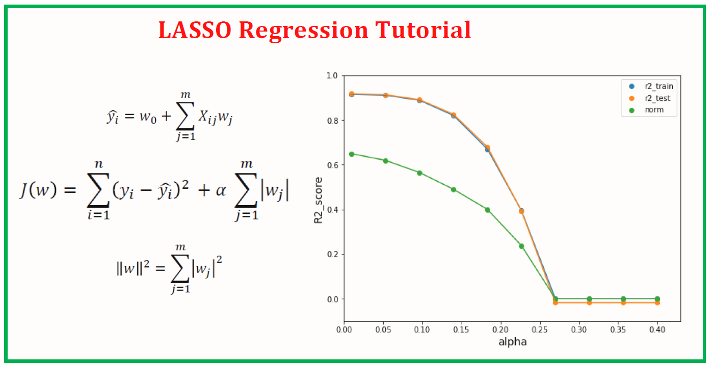

# Day 66 | Introduction Lasso Regression
Lasso regression is a linear regression technique that uses L1 regularization to encourage sparsity in the model, effectively performing both variable selection and regularization by shrinking coefficients of less important features to zero, thus simplifying the model and improving its interpretability and prediction accuracy. 

## What it is:
Lasso regression, also known as Least Absolute Shrinkage and Selection Operator, is a linear regression model that adds a penalty term to the loss function, which is based on the absolute values of the coefficients. 

## Purpose:
The primary goal of Lasso regression is to find a balance between model simplicity and accuracy by shrinking coefficients towards zero, effectively performing feature selection and reducing overfitting. 

## How it works:
- **L1 Regularization:** Lasso uses L1 regularization, which adds a penalty term to the loss function that is proportional to the sum of the absolute values of the coefficients. 
- **Coefficient Shrinkage:** This penalty term encourages the coefficients of less important features to shrink towards zero, effectively removing them from the model. 
- **Sparse Solutions:** The result is a sparse model, meaning that some coefficients are exactly zero, leading to a simpler and more interpretable model. 

## When to use it:
- **Feature Selection:** When you have a large number of features and want to identify the most important ones. 
High-Dimensional Data: When dealing with datasets that have a high number of features compared to the number of observations. 
- **Overfitting:** When you suspect that your model is overfitting the training data. 
- **Multicollinearity:** When there is high multicollinearity among predictors. 

## Advantages:
- **Feature Selection:** Automatically selects important features by setting the coefficients of less important features to zero. 
- **Model Simplicity:** Results in a simpler model that is easier to interpret. 
- **Improved Prediction Accuracy:** Can improve prediction accuracy by reducing overfitting and selecting relevant features. 

## Disadvantages:
- **Not as good as Ridge Regression for all cases:** Ridge regression may be better for situations where you want to retain all features but shrink their coefficients. 
- **Can be sensitive to the choice of the regularization parameter:** The regularization parameter (lambda) controls the strength of the penalty, and choosing the right value can be crucial for model performance.

## Image
