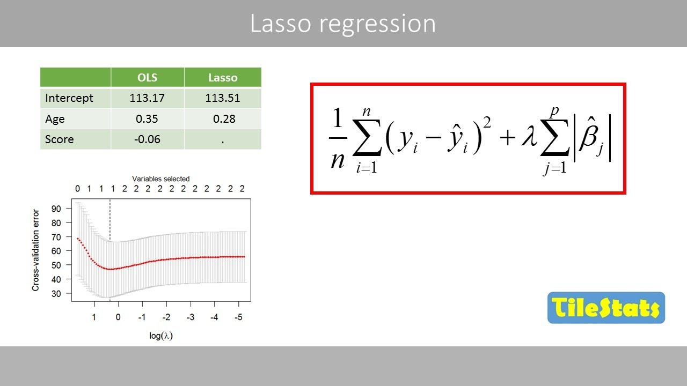
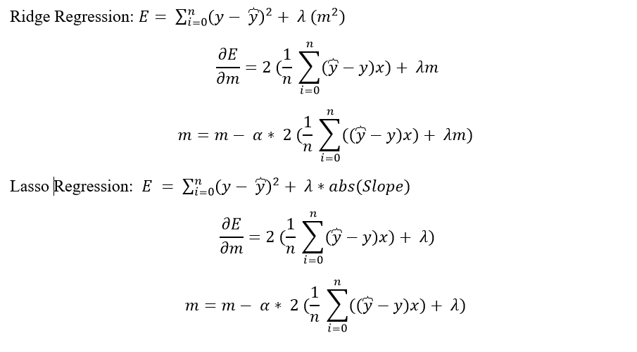

# Day 067 | Lasso Regression Mathematical Part

##  Mathematical Prove
Loss function for Linear Regression
- Loss Function L = $\sum_{i=1}^{n} (y_i-\hat{y_i})^2$
- $\hat{y_i} = mx_i - c$
- c = $\bar{y} - m \bar{x}$

<!-- - $\frac {δL}{δ\beta_0}$ = $\frac{1}{m}$ $[2*(y_1-\hat{y_1})(-1) + 2(y_2-\hat{y_2})(-1)]$ -->

Loss function for Lasso Regression
- Loss Function L = $\sum_{i=1}^{n} (y_i-\hat{y_i})^2 + 2\lambda |m|$ [`2` for simplyfy the quation]
- Loss Function L = $\sum_{i=1}^{n} (y_i - m x_i - c)^2 + 2\lambda |m|$
- Loss Function L = $\sum_{i=1}^{n} (y_i - m x_i - \bar{y} - m \bar{x})^2 + 2\lambda |m|$

> Here `|m|` is not differentiable function. so break |m| into 3 part 
> `m > 0`, |m| = m 
> `m = 0`, |m| = 0 
> `m < 0`, |m| = -m 

Derivatives this with respect to `m`
- L = $\sum_{i=1}^{n} (y_i - m x_i - \bar{y} + m \bar{x})^2 + \lambda |m|$
- L = $\sum_{i=1}^{n} (y_i - m x_i - \bar{y} + m \bar{x})^2 + \lambda m$
- $\frac {δL}{δm}$ = $2\sum(y_i - m x_i - \bar{y} + m \bar{x})(-x_i + \bar{x}) + 2\lambda$
- $\frac {δL}{δm}$ = $-2\sum(y_i - m x_i - \bar{y} + m \bar{x})(x_i - \bar{x}) + 2\lambda$

Now this equation will be `0` for find the `minima` slop
- $-2\sum(y_i - m x_i - \bar{y} + m \bar{x})(x_i - \bar{x}) + 2\lambda$ = $0$
- $-\sum(y_i - m x_i - \bar{y} + m \bar{x})(x_i - \bar{x}) + \lambda$ = $0$
- $\lambda -\sum(y_ - m x_i - \bar{y} + m \bar{x})(x_i - \bar{x})$ = $0$

- $\lambda -\sum[(y_i- \bar{y}) + m (x_i - \bar{x})](x_i - \bar{x})$ = $0$
- $\lambda -\sum[(y_i- \bar{y})(x_i - \bar{x}) + m (x_i - \bar{x})^2]$ = $0$
- $\lambda -\sum(y_i- \bar{y})(x_i - \bar{x}) +\sum m (x_i - \bar{x})^2$ = $0$
- $\sum m (x_i - \bar{x})^2$ = $\sum(y_i- \bar{y})(x_i - \bar{x})-\lambda$

-  $m$ = $\frac{\sum(y_i- \bar{y})(x_i - \bar{x})-\lambda}{(x_i - \bar{x})^2}$ 

<!-- -  $m ∝ \frac{1}{X}$  -->

### When , M>0
-  $m$ = $\frac{\sum(y_i- \bar{y})(x_i - \bar{x})-\lambda}{(x_i - \bar{x})^2}$ 
  
### When , M=0
-  $m$ = $\frac{\sum(y_i- \bar{y})(x_i - \bar{x})}{(x_i - \bar{x})^2}$ 

### When , M<0
-  $m$ = $\frac{\sum(y_i- \bar{y})(x_i - \bar{x})+\lambda}{(x_i - \bar{x})^2}$ 

## Ridge vs Lasso Regression
- Ridge Regression
- -  $m$ = $\frac{\sum(y_i- \bar{y})(x_i - \bar{x})-\lambda}{(x_i - \bar{x})^2}$ 
> if $\sum(y_i- \bar{y})(x_i - \bar{x})$ = $\lambda$ then `m` is `0(Zero)`  
> if $\sum(y_i- \bar{y})(x_i - \bar{x})$ < $\lambda$ then `m` is `Negative (-m))` which is impossible 
> it can be `Zero(0)`

- Lasso Regression
> -  $m$ = $\frac{\sum(y_i- \bar{y})(x_i - \bar{x})}{\sum (x_i - \bar{x})^2 + \lambda }$  
> 
> It cannot be `Zero(0)` 

## Images

