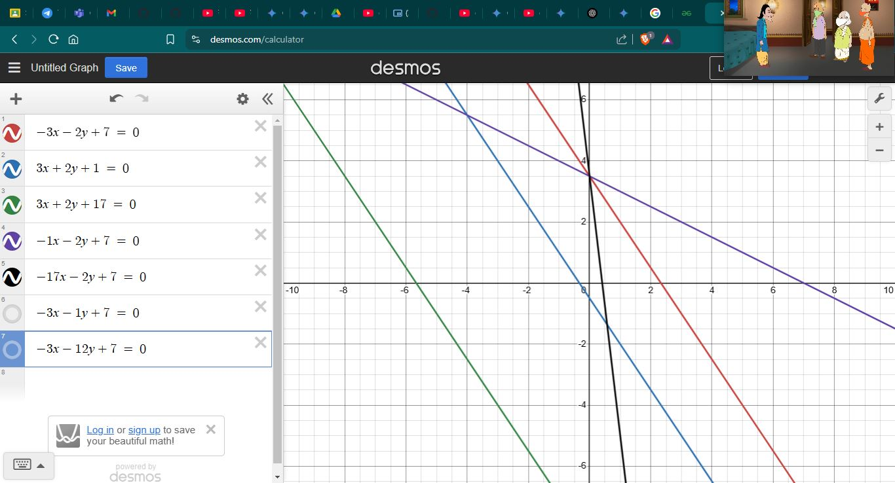
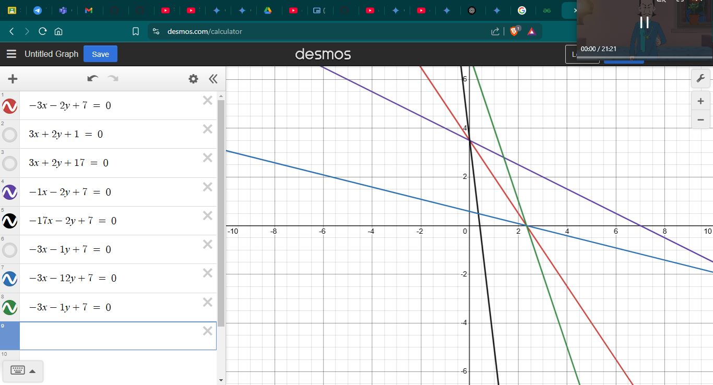
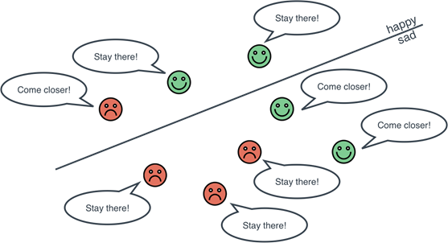
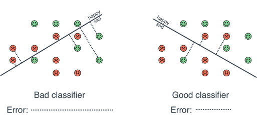

# Day 69 | Logistic Regression | Perceptron Trick
Logistic regression estimates the probability of an event occurring, such as voted or didn’t vote, based on a given data set of independent variables.

Logistic regression is a supervised machine learning algorithm widely used for binary classification tasks, such as identifying whether an email is spam or not and diagnosing diseases by assessing the presence or absence of specific conditions based on patient test results

Logistic regression is a fundamental and widely used machine learning algorithm for binary classification problems. Despite its name, it's a classification algorithm, not a regression algorithm. It predicts the probability of a `binary outcome` (e.g., `yes/no`, `true/false`, `0/1`).


## 1. The Problem:
- Binary classification: Predicting one of two possible outcomes.
- Examples:
    - Email spam detection (spam or not spam).
    - Medical diagnosis (disease or no disease).
    - Customer churn prediction (churn or not churn).

## 2. The Logistic Function (Sigmoid):
Logistic regression uses the sigmoid function `(σ)` to map any real-valued number to a value between 0 and 1.
- Formula: `σ(z) = 1 / (1 + e^(-z))`
- The sigmoid function produces an S-shaped curve.
- It's used to interpret the output of the linear combination of features as a probability.

## 3. The Model:
Logistic regression models the probability of the positive class (e.g., 1) as: `P(y=1 | x) = σ(β₀ + β₁x₁ + β₂x₂ + ... + βₚxₚ)` <br>
- Where:
    - y: The binary outcome (0 or 1).
    - x₁, x₂, ..., xₚ: The independent variables (features).
    - β₀, β₁, β₂, ..., βₚ: The coefficients.
    - σ: The sigmoid function.
- The term inside the sigmoid function is a linear combination of the input features, which looks similar to a linear regression.

## 4. The Decision Boundary:

- The decision boundary is the threshold that separates the two classes.
- Typically, a threshold of 0.5 is used.
    - If P(y=1 | x) ≥ 0.5, the prediction is class 1.
    - If P(y=1 | x) < 0.5, the prediction is class 0.
- The decision boundary is linear in the feature space.

## 5. Training the Model (Finding the Coefficients):
- Logistic regression uses maximum likelihood estimation (MLE) to find the coefficients that maximize the likelihood of the observed data.
- The loss function used is the cross-entropy loss (or log loss).
- Optimization algorithms like gradient descent are used to minimize the loss function and find the optimal coefficients.

## 6. Evaluating the Model:
- Common evaluation metrics for logistic regression include:
    - Accuracy.
    - Precision.
    - Recall.
    - F1-score.
    - AUC-ROC (Area Under the Receiver Operating Characteristic - curve).
    - Confusion Matrix.
    - Log loss.

## Key Advantages:
- Simple and efficient.
- Easy to interpret.
- Provides probability estimates.
- Works well for linearly separable data.

## Key Disadvantages:
- Assumes a linear relationship between features and the log-odds of the outcome.
- Can be sensitive to outliers.
- May not perform well for complex, non-linear relationships.

## When to Use Logistic Regression:
- Binary classification problems.
- When you need probability estimates.
- When you have linearly separable data or can transform it to be linearly separable.
- As a baseline model.

## Mathematical Calculation
General Equation: $Ax + By + C = 0$

### Label Region
1. Positive Region: `Ax + By + C > 0`
2. Negative Region: `Ax + By + C < 0`

- `C` is intercept
- `A` is coeffient or `X` axis distance
- `B` is coeffient or `Y` axis distance

### Transformation
- Assume, point `p(7, 9)`
- Assume, Line = `2x+3y+5 = 0`

Transformation:
```
  2 3 5
- 7 9 1
---------
-5 -6  4

New Line = -5x-6y+4
```

### Condition
- Positive Region, Negative Point - (Subtract -)
- Negative Region, Positive Point - (Addition +)

This line change is very crucial and instant
for smooth of this use `eta`

- $Coef_n = Coef_o - \eta*Coordinate$

## Equation Simplify
- $\omega_1$ = A
- $\omega_2$ = B
- $\omega_0$ = C
- $X_1$ = X
- $X_2$ = Y
- $X_0$ = [1,1,..,1] axis=1

So the Equation is:
- Ax+By+C = 0
- $\omega_0 + \omega_1X_1+\omega_2X_2 = 0$
- $\omega_0X_0 + \omega_1X_1+\omega_2X_2 = 0$
- $\sum\omega_iX_i =0$

### Prediction
- $\sum\omega_iX_i \geq 0 = 1$
- $\sum\omega_iX_i < 0 = 0$

## Algorithm
- $eopch:1000, \eta = 0.1$
- for i->epochs
- pick a random `row`  
  -  $if X_i \in N \ and \ \sum \omega_i X_i \geq 0$
     -  $\omega_n = \omega_o -\eta X_i$
  -  $if X_i \in P \ and \ \sum \omega_i X_i < 0$
     -  $\omega_n = \omega_o + \eta X_i$

Simplify this equation
- <span style="color: #42f5bf"> $\omega_n = \omega_o + \eta (Y_i-\hat{Y_i}) X_i$ </span>

## Images




