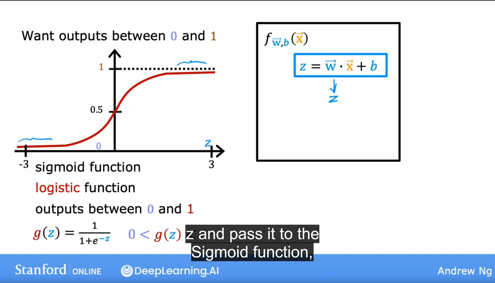

# Day 71 | Logistic Regression | Sigmoid
In logistic regression, the sigmoid function, also known as the logistic function, is used to map the output of a linear model to a probability between 0 and 1, making it suitable for binary classification tasks. 

## 1. What is Logistic Regression?
- Logistic regression is a statistical method used for predicting the probability of a binary outcome (0 or 1). 
- It models the relationship between input features and the log-odds of the event occurring. 
- Unlike linear regression, which predicts continuous values, logistic regression predicts probabilities. 

## 2. The Role of the Sigmoid Function
- The sigmoid function, defined as `f(x) = 1 / (1 + e^(-x))`, takes any real-valued number as input and outputs a value between `0` and `1`. 
- This output can be interpreted as a probability. 
- The sigmoid function is crucial because it transforms the output of the linear model (which can be any real number) into a probability range suitable for binary classification. 

## 3. How it Works
- In logistic regression, the input features are combined linearly, and the result is fed into the sigmoid function. 
- The sigmoid function then outputs a probability, which can be interpreted as the likelihood of the event occurring. 
- For example, if the output of the `sigmoid function is 0.7`, it means there's a 70% chance of the event occurring. 
- A common threshold of 0.5 is used to classify the outcome: if the probability is above 0.5, it's classified as 1; otherwise, it's classified as 0. 

## 4. Why use the Sigmoid Function?
### Probability Output:
The sigmoid function ensures the output is always between 0 and 1, which is essential for representing probabilities. 
### Non-Linearity:

It introduces non-linearity into the model, allowing it to capture complex relationships between input features and the target variable. 
### Differentiable:

The derivative of the sigmoid function is easy to calculate, which is important for optimization algorithms like gradient descent used to train the model. 
### Intuitive Interpretation:

The output can be easily interpreted as a probability, making it easier to understand the model's predictions. 

## 5. Example
- Imagine you're building a model to predict whether a customer will click on an advertisement or not (binary outcome: click or no click). 
- You use logistic regression to model the relationship between various factors (e.g., age, location, ad type) and the click probability. 
- The sigmoid function transforms the output of the linear model into a probability between 0 and 1, representing the likelihood of a click. 

## Mathematical Calculation

- Sigmoid Function: $\displaystyle f(z) = \frac{1}{1+  e^{-z}}$
<!-- - $\displaystyle \frac{\partial f}{\partial x}$ -->
Here, $f(z) = \sum W_iX_i$

Simplify this equation
-  $\omega_n = \omega_o + \eta (Y_i-\hat{Y_i}) X_i$ 

$\hat{Y} = \sigma(z)$\
$\sigma(z) = \displaystyle \frac{1}{1+  e^{-z}}$

For overcome, $(Y_i-\hat{Y_i}) \neq 0$\
Range $0<\sigma(z)<1$

- $\sigma(z) < 0.5 = 0$
- $\sigma(z) \ge 0.5 = 1$

## Images

