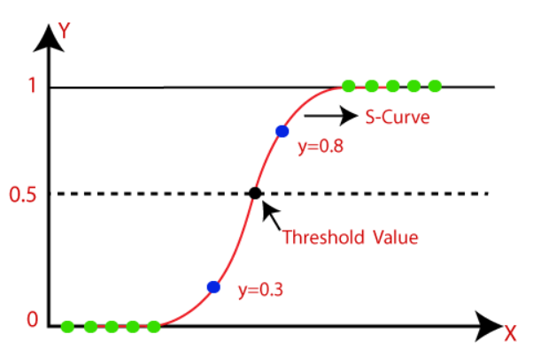

# Day 72 | Logistic Regression | Maximum Likelihood | Binary Cross Entropy | Log Loss Error
Maximum Likelihood Estimation (MLE) in machine learning is a method to find the most likely values of a model's parameters by maximizing the likelihood function, which represents the probability of observing the given data under those parameters. 

## Here's a more detailed explanation:
### What is MLE?
Parameter Estimation:
MLE is a statistical technique used to estimate the parameters of a model, meaning finding the values that best explain the observed data. 

### Likelihood Function:
The core concept is the likelihood function, which quantifies how well a model explains the observed data for a given set of parameters. 

### Maximization:
MLE aims to find the parameter values that maximize the likelihood function, effectively identifying the most plausible estimates based on the data. 

### Probabilistic Approach:
MLE is a probabilistic approach, meaning it relies on the probability distribution of the data to estimate the parameters.

## How it Works
1. **Define a Model:**
Start with a statistical model that you believe describes the data. 
2. **Define the Likelihood Function:**
Determine the likelihood function, which represents the probability of observing the data given the model parameters. 
3. **Maximize the Likelihood:**
Find the parameter values that maximize the likelihood function, either analytically or numerically. 
4. **Maximum Likelihood Estimate:**
The parameter values that maximize the likelihood function are called the maximum likelihood estimates (MLEs). 

## Why is MLE Important in Machine Learning?
- **Model Training:**
MLE is a fundamental technique for training many machine learning models, including linear regression, logistic regression, and neural networks. 
- **Parameter Estimation:**
It provides a principled way to estimate the parameters of probabilistic models, which are common in machine learning. 
- **Versatile:**
MLE can be used with various statistical models, both parametric and non-parametric. 
- **Asymptotic Efficiency:**
MLE is known to be asymptotically efficient, meaning that as the sample size increases, the MLE becomes more and more accurate. 
- **Example**
Imagine you're trying to estimate the probability of getting heads in a coin toss experiment. 
- **Model:**
Assume the coin tosses are independent and identically distributed (i.i.d.) Bernoulli trials. 
- **Likelihood Function:**
The likelihood function would represent the probability of observing the sequence of heads and tails given a certain probability of getting heads (the parameter you want to estimate). 
- **Maximization:**
You would find the value of the probability of heads that maximizes the likelihood function, given the observed data (e.g., 60 heads out of 100 tosses).

## Mathematical Calculation
- Probability: $\hat{Y} = \sigma(z)$
- Probability: $\sigma(z) = \sum W_i X_i$ (Perceptron)
- Probability: $\sigma(z) = \displaystyle \frac{1}{1-e^{-z}}$ (Sigmodial)
- Here: $\sigma(z)$ is $0\hArr1$

### Maximum Likelhood
Multiplication of all pobabilities of all points.
- max = $P(G_1)*P(G_2)*P(R_1)*P(R_2)$
- Calculate All points `P(G)` value, Extract `P(R)` from `(1-P(G))`
- For max likelhood = Better Result

Problem with MaxL:
- Smaller number multiplication is approximate `0`
- Overcome this problem use, `cross entropy` (summation)

## Cross Entropy
$\log (max) = \log(G_1) +  \log(G_2) + \log(R_1) + \log(R_2)$
- log of `smaller` number is `negative`
- Overcome: multiply with (-1)

$\log (max) = \log(G_1) -  \log(G_2) - \log(R_1) - \log(R_2)$

## General Equation
$-Y_i \log(\hat{Y_i}) - (1-Y_i) \log (1-\hat{Y_I})$
- if $Y_i =0$, $\log (1-\hat{Y_I})$ 
- if $Y_i =1$, $\log (\hat{Y_I})$ 

## Loss Function or Binary Cross Entropy
$L=\sum -Y_i \log(\hat{Y_i}) - (1-Y_i) \log (1-\hat{Y_I})$

average loss function
- $\displaystyle L=\frac{1}{n} \sum -Y_i \log(\hat{Y_i}) - (1-Y_i) \log (1-\hat{Y_I})$

## Images
