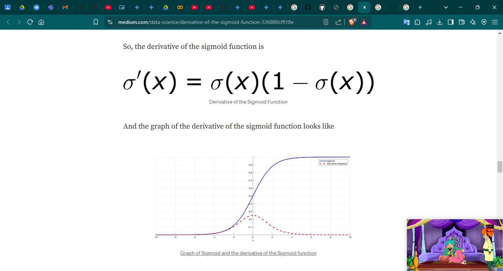

# Day 73 | Logistic Regression | Sigmodial Function Derivatives

A sigmoid function is any mathematical function whose graph has a characteristic S-shaped or sigmoid curve.\
A common example of a sigmoid function is the logistic function, which is defined by the formula[1]

- $\sigma(z) = \displaystyle \frac{1}{1-e^{-z}}$

### Differentiation with respect to `X`

- $\displaystyle \frac{d}{dx} \sigma(x)$ $= \displaystyle -\frac{1}{(1-e^{-z})^2} (-e^{-x})$
- $\displaystyle \frac{d}{dx} \sigma(x)$ $= \displaystyle \frac{e^{-x}}{(1-e^{-z})^2}$
- $\displaystyle \frac{d}{dx} \sigma(x)$ $= \displaystyle \frac{1}{(1-e^{-z})} * \frac{e^{-x}}{(1-e^{-z})}$
- $\displaystyle \frac{d}{dx} \sigma(x)$ $= \displaystyle \sigma(x) * \frac{e^{-x}}{(1-e^{-z})}$
- $\displaystyle \frac{d}{dx} \sigma(x)$ $= \displaystyle \sigma(x) * [\frac{1+e^{-x}-1}{(1-e^{-z})}]$
- $\displaystyle \frac{d}{dx} \sigma(x)$ $= \displaystyle \sigma(x) * [\frac{1+e^{-x}}{(1-e^{-z})} \frac{1}{(1-e^{-z})}]$
- $\displaystyle \frac{d}{dx} \sigma(x)$ $= \displaystyle \sigma(x) * [1- \sigma(x)]$

So the derivatives is:\
$\displaystyle \frac{d}{dx} \sigma(x)$ $= \displaystyle \sigma(x) * [1- \sigma(x)]$

## Images

