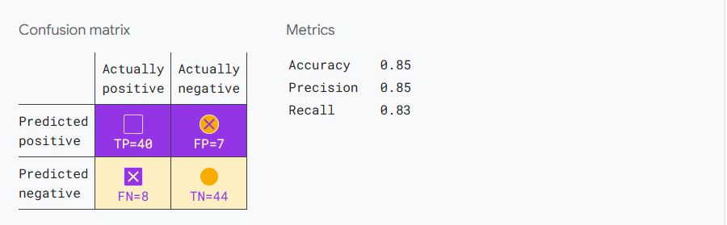
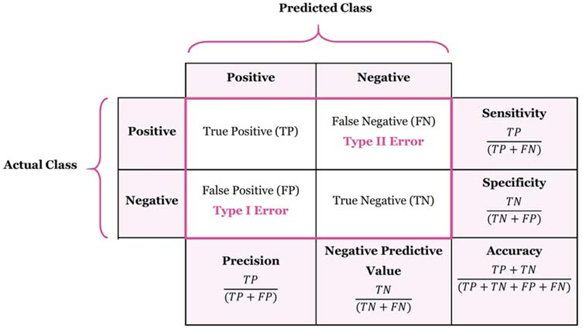

# Day 075 | Classification Metrics | Logistic Regression | Classification | Accuracy | Confusion

`True` and `false`, `Positives` and `Negatives` are used to calculate several useful metrics for evaluating models. Which evaluation metrics are most meaningful depends on the specific model and the specific task, the cost of different misclassifications, and whether the dataset is balanced or imbalanced.

## 1. Accuracy
`Accuracy` is the proportion of all classifications that were correct, whether positive or negative

- **Definition:** The proportion of correctly classified instances out of the total number of instances.
- **Formula:** Accuracy = (True Positives + True Negatives) / (Total Instances)
- **Interpretation:** Represents the overall correctness of the model.
- **When to Use:** Useful when the class distribution is balanced (roughly equal number of instances in each class).
- **Limitations:** Can be misleading in cases of imbalanced datasets, where a model that always predicts the majority class can achieve high accuracy without being useful for the minority class.

<math xmlns="http://www.w3.org/1998/Math/MathML" display="block">
  <mtext>Accuracy</mtext>
  <mo>=</mo>
  <mfrac>
    <mtext>correct classifications</mtext>
    <mtext>total classifications</mtext>
  </mfrac>
  <mo>=</mo>
  <mfrac>
    <mrow>
      <mi>T</mi>
      <mi>P</mi>
      <mo>+</mo>
      <mi>T</mi>
      <mi>N</mi>
    </mrow>
    <mrow>
      <mi>T</mi>
      <mi>P</mi>
      <mo>+</mo>
      <mi>T</mi>
      <mi>N</mi>
      <mo>+</mo>
      <mi>F</mi>
      <mi>P</mi>
      <mo>+</mo>
      <mi>F</mi>
      <mi>N</mi>
    </mrow>
  </mfrac>
</math>

## 2. Confusion Matrix:

- **Definition:** A table that summarizes the performance of a - - **classification model by showing the counts of:**
    - **True Positives (TP):** Instances that are actually positive and are correctly predicted as positive.
    - **True Negatives (TN):** Instances that are actually negative and are correctly predicted as negative.
    - **False Positives (FP):** Instances that are actually negative but are incorrectly predicted as positive `(Type I error)`.   
    - **False Negatives (FN):** Instances that are actually positive but are incorrectly predicted as negative `(Type II error)`.
- **Interpretation:** Provides a detailed breakdown of the model's predictions, allowing you to see the types of errors it's making.
- **Usefulness:** Essential for understanding the model's strengths and weaknesses, especially in imbalanced datasets.

## Images

