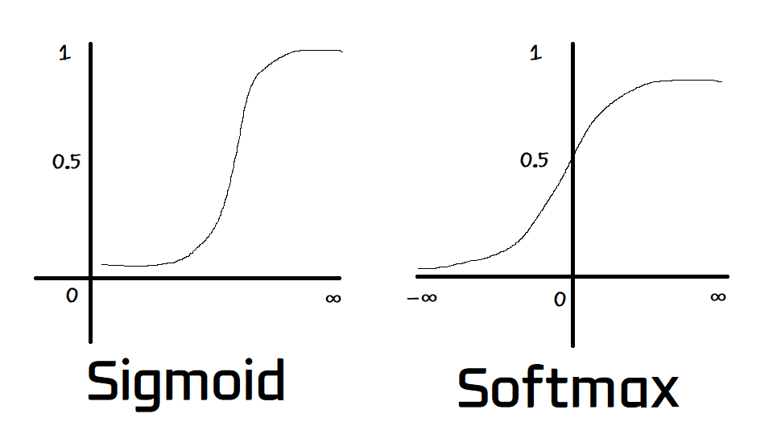

# Day 077 | Multinomial Logistic Regression | Softmax Regression

Softmax Regression, also known as Multinomial Logistic Regression, is a generalization of logistic regression used for multi-class classification problems. While binary logistic regression is used to classify data into two classes, softmax regression is used when there are three or more possible classes.

In softmax regression, the model computes a probability distribution over all possible classes using the softmax function. This function converts the raw prediction scores (also known as logits) for each class into probabilities that sum up to 1. The class with the highest probability is chosen as the final prediction.

## Softmax Function Formula
$\displaystyle \sigma(z)_i = \frac{e^{z_i}}{\sum e^{z_j}}$\
Here, $\sigma(z_1)+\sigma(z_2)+\sigma(z_3) = 1$

## Logistic and Softmax Regression Loss Function
1. Logistic Reg Loss = $\displaystyle L=-\frac{1}{m} \sum Y_i \log(\hat{Y_i}) + (1-Y_i) \log (1-\hat{Y_I})$
2. Softmax:  $\displaystyle L = -\frac{1}{m} \sum_i \sum_k Y_k^{i} \log(\hat{Y_k^{i}})$

## Example 1
When Classes is 3 (1,2,3) and rows is 3, Then\

$=y_1^1 \log(\hat{y_1}^1) + y_2^2 \log(\hat{y_2}^2) + y_3^3 \log(\hat{y_3}^3)$

$=> \hat{y_1}^1 = \sigma (w_1^1X_{11} + w_2^1X_{12} + w_0^1)$\
$=> \hat{y_2}^2 = \sigma (w_1^2X_{21} + w_2^2X_{22} + w_0^2)$\
$=> \hat{y_3}^3 = \sigma (w_1^3X_{31} + w_2^3X_{32} + w_0^3)$

$\begin{bmatrix}
w_1^1 & w_2^1 & w_0^1\\
w_1^2 & w_2^2 & w_0^2\\
w_1^3 & w_2^3 & w_0^3\\
\end{bmatrix}$

## Images

