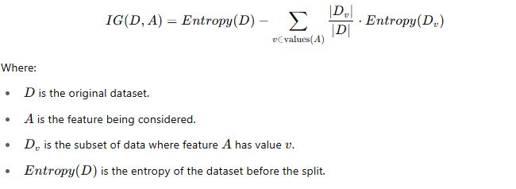
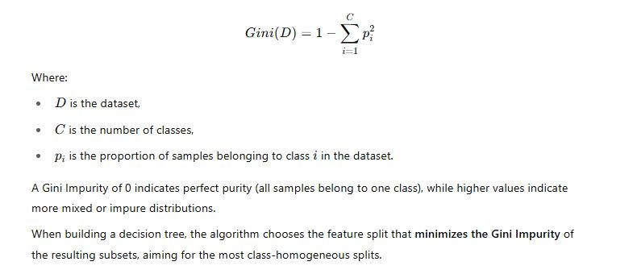
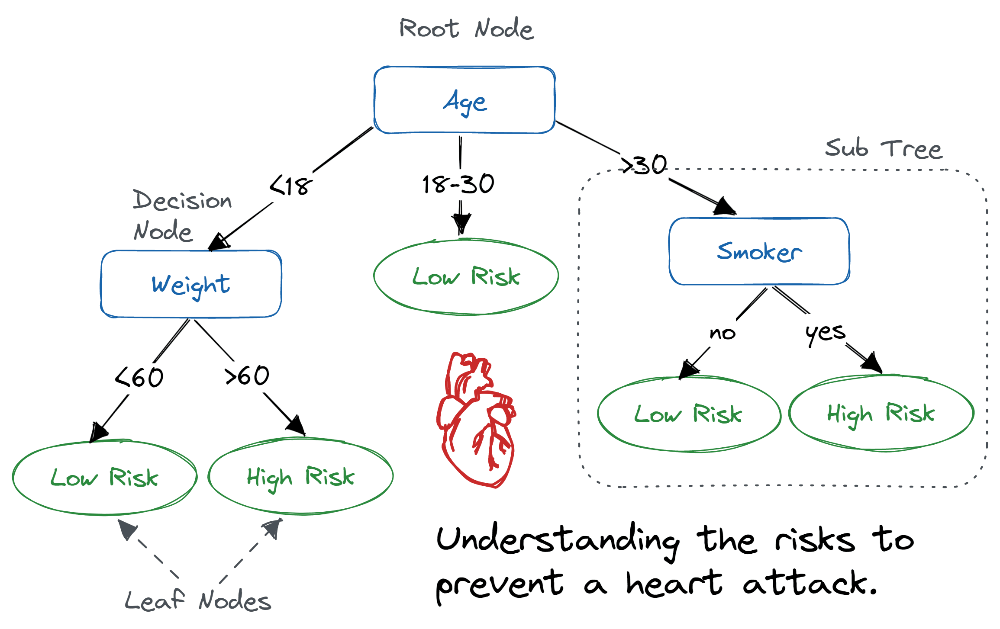

# Day 80 | Decision Tree Geometric Intution | Entropy | Information Gain | Gini

A `Decision Tree` is a supervised machine learning algorithm used for both `classification and regression` tasks. It models decisions and their possible consequences in a `tree`-like structure, where *each internal node* represents a feature (or attribute), *each branch* represents a decision rule, and *each leaf* node represents an outcome or class label.

The tree is built by splitting the dataset into subsets based on the feature that results in the most significant gain in information or the greatest reduction in impurity. Common metrics used to determine the best splits include `Gini Impurity`, `Entropy (Information Gain)`, and `Variance Reduction (for regression)`.

Decision trees are easy to interpret, require little data preprocessing, and can handle both numerical and categorical data. However, they can easily overfit the training data, which is why techniques like pruning or ensemble methods (e.g., Random Forests) are often used to improve their performance.

## Here breakdown of key concepts:
1. **Core Idea: Divide and Conquer**
    -  Decision Trees recursively partition the data into smaller and smaller subsets based on the values of the input features.   
    -  The goal is to create subsets where all (or most) of the - instances within each subset belong to the same class (for - classification) or have similar target values (for regression).

2. **Structure of a Decision Tree:**
    - Root Node: The starting point of the tree, representing the entire dataset.   
    - Internal Nodes (Decision Nodes): Represent tests on a specific attribute (feature). The outcome of the test determines which branch to follow.   
    - Branches: Represent the possible outcomes of a test at an internal node.   
    - Leaf Nodes (Terminal Nodes): Represent the final prediction. In classification, it's the class label assigned to the data points reaching that leaf. In regression, it's the predicted numerical value. 

3. **Splitting Criteria: How to Choose the Best Test?**\
The algorithm needs a way to determine which feature to split on at each internal node and what the split point should be. The goal is to choose splits that lead to the most homogeneous (pure) subsets with respect to the target variable. Common splitting criteria include:   

    - **For Classification:**
        - **Gini Impurity:** Measures the degree of probability of a particular variable being wrongly classified when it is randomly chosen. A Gini index of 0 indicates perfect purity (all instances belong to the same class).   
        - **Entropy:** Measures the randomness or impurity in a set of examples. Entropy of 0 means the set is perfectly homogeneous.
        - **Information Gain:** The reduction in entropy (or Gini impurity) achieved by splitting the dataset on a particular attribute. The attribute with the highest information gain is usually chosen for the split.   
    
    - **For Regression:**
        - **Mean Squared Error (MSE) Reduction:** The split that results in the largest decrease in MSE of the target variable within the resulting subsets is chosen.   
        - **Mean Absolute Error (MAE) Reduction:** Similar to MSE, but uses the absolute difference.   

4. **Building the Tree: The Recursive Process**
   
The decision tree is built using a recursive process:

    1. Start with the root node containing the entire dataset.
    2. If all instances in the current node belong to the same class (or the target values are very similar in regression), create a 1.1 leaf node with the prediction.
    3. Otherwise, select the best attribute and split point based on the chosen splitting criterion.
    4. Create child nodes corresponding to the outcomes of the split.
    5. Recursively repeat steps 2-4 for each child node until a stopping condition is met.   

5. **Stopping Conditions: When to Stop Splitting?**

To prevent the tree from growing too complex and overfitting the data, stopping conditions are used:

    - All instances in a node belong to the same class (or have very similar target values).
    - No remaining attributes to split on.
    - The number of instances in a node falls below a certain threshold.   
    - The maximum depth of the tree is reached.
    - The improvement in the splitting criterion falls below a certain threshold.   

1. **Advantages of Decision Trees:**

    - Easy to Understand and Interpret: The tree structure makes the decision-making process transparent.   
    - **Handle Both Categorical and Numerical Data:** Can naturally work with different types of features.   
    - **Non-Parametric:** Make no assumptions about the underlying data distribution.
    - **Feature Importance:** Can provide insights into which features are most important for prediction.   
    - **Relatively Fast to Train and Predict.**

7. **Disadvantages of Decision Trees:**

    - **Tendency to Overfit:** Can create very complex trees that memorize the training data, leading to poor performance on unseen data.   
    - **Sensitive to Small Changes in Data:** A small change in the training data can lead to a completely different tree structure.   
    - **Can be Unstable:** High variance.
    - **Not Always the Most Accurate:** Other algorithms might perform better in terms of prediction accuracy for certain datasets.
    - **Bias towards Features with More Levels:** Splitting criteria can sometimes favor features with a larger number of possible values.   

8. **Addressing Overfitting: Pruning**

To combat overfitting, decision trees are often pruned after they are built. Pruning involves removing branches or nodes that do not improve generalization performance. Common pruning techniques include:   

- **Pre-pruning:** Setting stopping conditions during the tree building process to prevent excessive growth.   
- **Post-pruning:** Building a full tree and then removing subtrees or nodes based on some criteria (e.g., cross-validation performance).  

## Especial
1. Pseudo Code
   1. Datasets with `labeled data`
   2. Select `Best Feature` (Root/Parent Node)
   3. Split Based on the `Correct Condition` (0, 1)
   4. Recursive for all data

## Calculate `Entropy`
- $E(s) = \sum -P_i log_2 P_i$
- $E(s) = -P_y log_2 P_y - P_n log_2 P_n - P_m log_2 P_m ...$
- Here,
  - $P_i =$ Probabilities of Classes

## Observation
1. More uncertinity, more entropy
2. for 2 classes
   1. Minimum Entropy = 0
   1. Maximum Entropy = 1
3. for  more than 2 classes
   1. Minimum Entropy = 0
   1. Maximum Entropy $\ge$ 1

## Information Gain
Information Gain (IG) is a metric used to measure how well a feature separates the training examples according to their target labels. It is commonly used in building Decision Trees to decide which feature to split on at each node.

Information Gain is based on the concept of entropy, which quantifies the impurity or uncertainty in a dataset. The idea is to choose the feature that results in the largest reduction in entropy after the split, i.e., the feature that gives the most information about the target variable.

## Gini Impurity
`Gini Impurity` is a metric used to measure the degree of impurity or disorder in a dataset. It is commonly used in decision tree algorithms like CART (Classification and Regression Trees) to determine the best feature and threshold to split the data.

Gini Impurity represents the probability that a randomly chosen instance from the dataset would be incorrectly classified if it were randomly labeled according to the distribution of labels in that subset.

The formula for Gini Impurity is:

- $G_i = 1 - (P_y^2 + P_n^2)$

## Images

