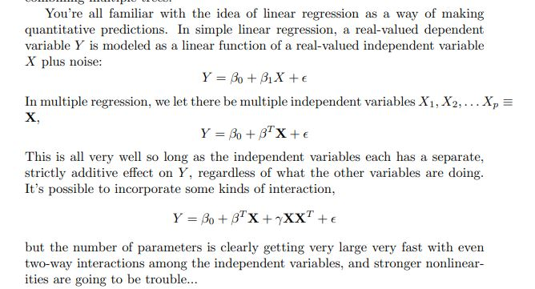
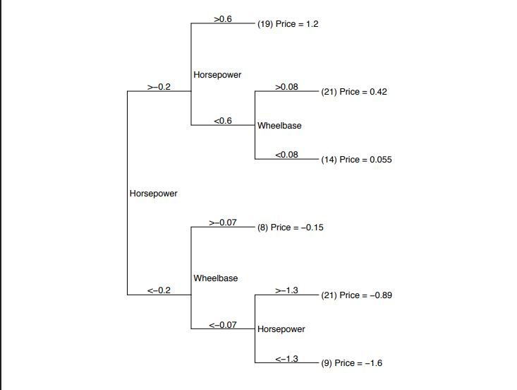
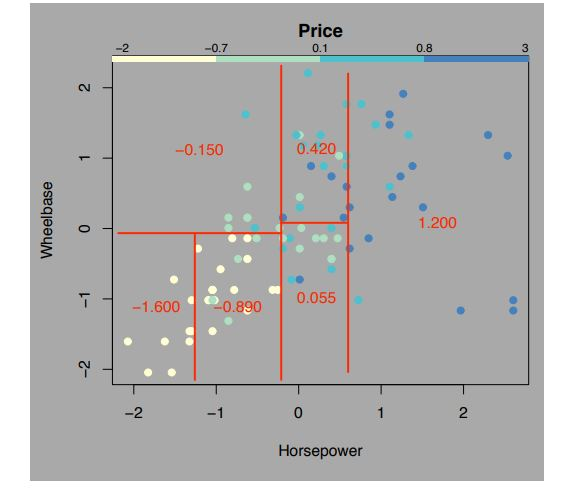
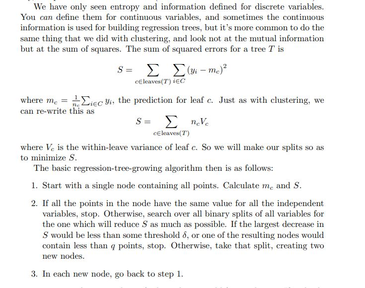

# Day 82 | Regression Trees

## Regression Trees
A Regression Tree is a type of decision tree used for predicting continuous numeric values instead of class labels. It splits the data into regions based on input features, just like classification trees, but instead of assigning a class to each region, it assigns a numerical value — typically the mean of the target variable in that region.

At each internal node, the algorithm chooses the feature and split point that minimizes a loss function — usually the mean squared error (MSE) — across the resulting subsets. The process continues recursively until a stopping condition is met (e.g., minimum number of samples per leaf or maximum tree depth).

The prediction for a new data point is made by following the decision rules down the tree until a leaf is reached, and then returning the value associated with that leaf.

Regression Trees are easy to interpret and can model non-linear relationships, but like classification trees, they can overfit the data if not pruned or regularized.

## Gemini
Regression Trees are a type of decision tree specifically used for regression tasks, where the goal is to predict a continuous numerical value rather than a categorical class. Here's a breakdown for your notes:

## 1. Prediction:
Regression Trees predict a numerical value, unlike classification trees which predict a class.

## 2. Splitting Criteria:
Splitting is typically based on minimizing the variance or Mean Squared Error (MSE) within each resulting subset. The algorithm seeks to find splits that create subsets with target values as similar as possible.

## 3. Leaf Nodes:
Leaf nodes contain a numerical prediction, often the average of the target values of the training instances that fall into that leaf.

## 4. Tree Building:
The tree is built recursively, similar to classification trees, by repeatedly splitting the data based on feature values.

## 5. Overfitting:
Regression trees are prone to overfitting, so techniques like pruning are used to control tree complexity.

## 6. Interpretability:
Like classification trees, regression trees are relatively easy to interpret.

## 7. Piecewise Constant Function:
Regression trees essentially approximate the target function with a piecewise constant function.

## 8. Applications:
They are used in various fields like finance, environmental science, and any area where predicting a continuous value is needed.

## 9. Ensemble Methods:
Regression trees are often used as building blocks for more powerful ensemble methods like Random Forests and Gradient Boosting.

## Images

