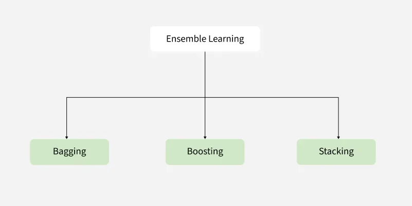
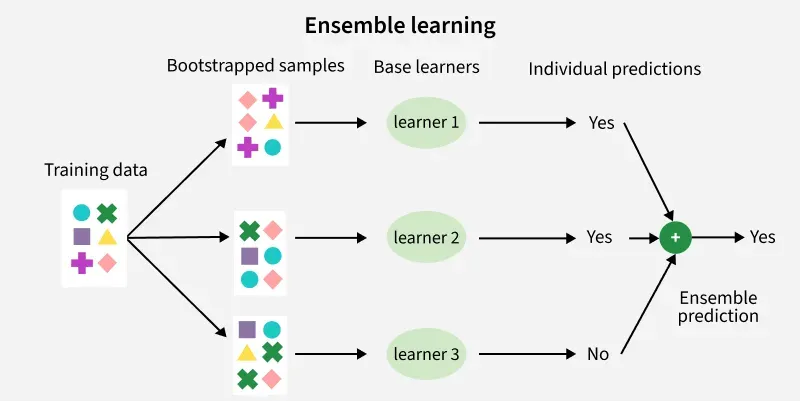
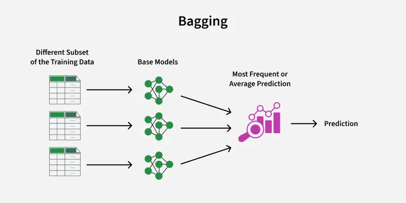
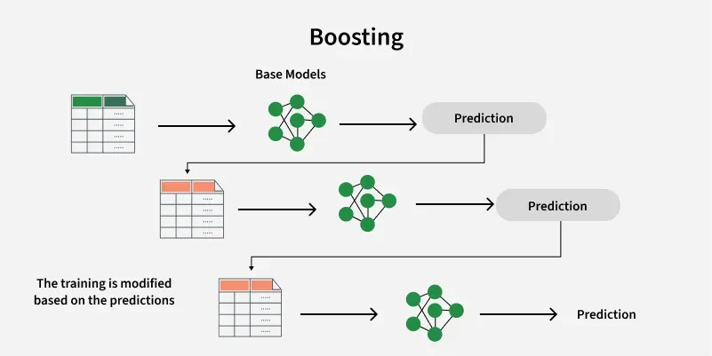
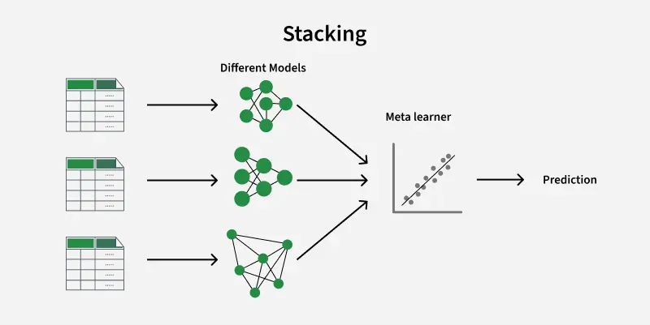

# Day 84 | Introduction to Ensemble Learning | Voting, Bagging, Boosting, Stacking

## Ensemble Learning: Notes
Ensemble learning is a powerful machine learning technique that combines the predictions of multiple individual models (often called "base learners" or "weak learners") to produce a single, more robust and accurate prediction. The underlying principle is that a "wisdom of the crowd" effect can often lead to better results than relying on a single, potentially flawed, model.

## Key Concepts:
* **Weak Learners:** These are models that perform slightly better than random guessing. Examples include shallow decision trees, simple linear models, etc.
* **Strong Learner:** The final ensemble model that combines the predictions of the weak learners and achieves higher accuracy.
* **Diversity:** For an ensemble to be effective, the individual models should be as diverse as possible. This means they should make different types of errors and learn different aspects of the data.

## Why Use Ensemble Learning?
* **Improved Accuracy:** Ensembles can often achieve significantly higher accuracy than any of their constituent models.
* **Reduced Variance (Bagging):** By averaging or voting across multiple models trained on different subsets of the data, ensemble methods can reduce the impact of noise and outliers, leading to more stable predictions and better generalization.
* **Reduced Bias (Boosting):** By sequentially training models to correct the errors of previous models, boosting algorithms can reduce the bias of the overall model, leading to better performance on complex tasks.
* **Increased Robustness:** Ensembles are generally more robust to variations in the data and are less likely to overfit the training set compared to single complex models.
* **Flexibility:** Ensemble methods can be used with various types of base learners, allowing you to leverage the strengths of different algorithms.

## Types of Ensemble Learning Methods:
Ensemble methods are broadly categorized into a few main types based on how the base learners are trained and how their predictions are combined:

## 1. Bagging (Bootstrap Aggregating):
* **Parallel Training:** Multiple independent base learners are trained in parallel on different random subsets of the training data. These subsets are created using **bootstrapping** (sampling with replacement).
* **Goal:** Primarily aims to **reduce variance** and prevent overfitting.
* **Aggregation:** The predictions of the base learners are combined using:
    * **Voting:** For classification, the class with the majority of votes is the final prediction.
    * **Averaging:** For regression, the average of the predictions is the final prediction.
* **Examples:**
    * **Random Forest:** An ensemble of decision trees trained on different bootstrapped samples of the data and a random subset of features at each split.
    * **Bagged Decision Trees:** A simple ensemble where multiple decision trees are trained on bootstrapped samples.

## 2. Boosting:
* **Sequential Training:** Base learners are trained sequentially, with each new learner trying to correct the errors made by the previous learners.
* **Goal:** Primarily aims to **reduce bias** and improve accuracy.
* **Weighting:** Data points that were misclassified by previous learners are given higher weights, forcing subsequent learners to focus on these difficult instances.
* **Aggregation:** The predictions of the base learners are combined using a weighted sum or weighted voting, where more accurate learners typically have higher weights.
* **Examples:**
    * **AdaBoost (Adaptive Boosting):** Assigns weights to both data points and weak learners.
    * **Gradient Boosting Machines (GBM):** Builds trees in a stage-wise fashion, where each new tree predicts the residual errors of the previous ensemble.
    * **XGBoost (Extreme Gradient Boosting):** An optimized and highly effective gradient boosting implementation.
    * **LightGBM:** Another efficient gradient boosting framework.
    * **CatBoost:** A gradient boosting algorithm that handles categorical features well.

## 3. Stacking (Stacked Generalization):
* **Heterogeneous Models:** Typically involves training multiple different types of base learners on the same data.
* **Meta-Learner:** The predictions of the base learners are then used as input features for a "meta-learner" (or "aggregator model").
* **Goal:** Aims to learn the best way to combine the predictions of the base learners, potentially achieving higher accuracy by leveraging the strengths of different models.
* **Training:** The meta-learner is trained on a separate hold-out set or using cross-validation to avoid overfitting.
* **Aggregation:** The meta-learner makes the final prediction based on the outputs of the base learners.

## 4. Other Ensemble Techniques:
* **Voting:** A simple technique where multiple independent models (of the same or different types) make predictions, and the final prediction is based on the majority vote (classification) or average (regression).
* **Blending:** Similar to stacking but uses a hold-out set to train the meta-learner, and the base learners are typically not cross-validated.

## Advantages of Ensemble Learning:
* **Higher Predictive Accuracy:** Often outperforms single models.
* **Improved Generalization:** Reduces overfitting, especially bagging.
* **Handles Complex Relationships:** Can capture intricate patterns in the data, especially boosting.
* **More Robust to Noise and Outliers:** Averaging or voting can smooth out individual model errors.
* **Versatile:** Can be applied to various machine learning tasks and algorithms.

## Disadvantages of Ensemble Learning:
* **Increased Complexity:** Ensemble models can be more complex to understand and interpret than single models.
* **Longer Training Time:** Training multiple models can be computationally expensive and time-consuming.
* **Potential for Increased Resource Usage:** Storing and running multiple models requires more memory and processing power.
* **Not Always Guaranteed Improvement:** If the base learners are not diverse or are poorly chosen, the ensemble might not perform better than the best individual model.
* **More Difficult to Tune:** Ensembles have more hyperparameters to tune, both for the base learners and the aggregation method.

## Conclusion:
Ensemble learning is a powerful and widely used technique in machine learning for improving the performance and robustness of predictive models. By strategically combining the strengths of multiple learners, ensemble methods can often achieve state-of-the-art results across a wide range of applications. Understanding the different types of ensemble methods and their underlying principles is crucial for effectively applying them to real-world problems.

---

### Ensemble Learning

**Ensemble Learning** is a machine learning technique that combines the predictions of multiple models (called *base learners* or *weak learners*) to produce a more accurate and robust prediction than any individual model alone. The core idea is that a group of models working together can outperform a single model, especially when the individual models have complementary strengths.

There are three main types of ensemble methods:

1. **Bagging (Bootstrap Aggregating)**: Builds multiple models independently using different subsets of the training data sampled with replacement. The predictions are then averaged (for regression) or voted on (for classification). Example: **Random Forest**.

2. **Boosting**: Builds models sequentially, where each new model focuses on correcting the errors made by the previous ones. Examples include **AdaBoost**, **Gradient Boosting**, and **XGBoost**.

3. **Stacking**: Combines different types of models and uses another model (meta-learner) to learn how to best combine their outputs.

Ensemble learning often leads to **better generalization**, **reduced variance**, and **improved accuracy**, making it popular in many machine learning competitions and real-world applications.

---

## Images

