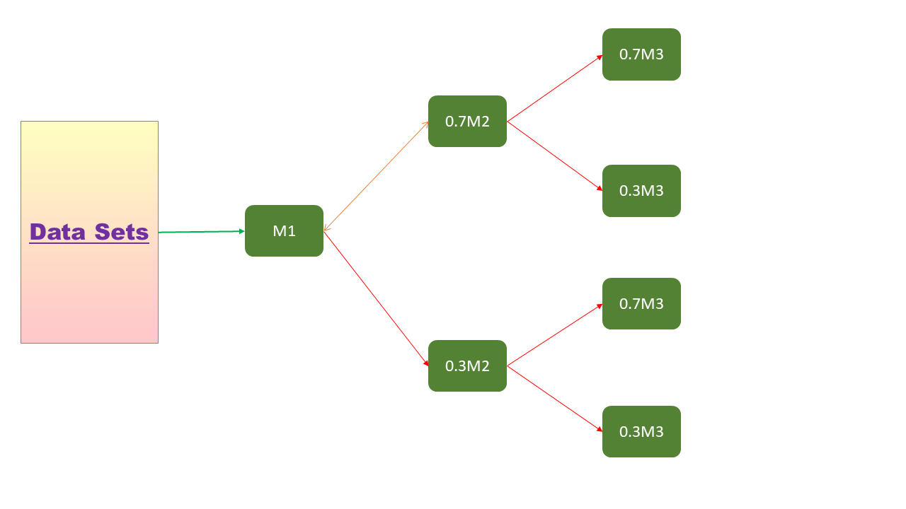
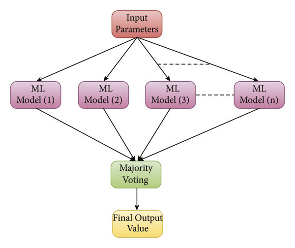

# Day 085 | Voting Ensemble | Introduction to Core Idea
A Voting Ensemble, also known as a majority voting ensemble, is a machine learning technique where predictions from multiple base models are combined to make a final prediction. This method aims to improve overall model performance by leveraging the strengths of different models. 

## How it Works:
* **Base Models:** The ensemble consists of multiple individual models, which can be different types of algorithms like decision trees, support vector machines, or logistic regression. 
* **Predictions:** Each base model makes a prediction for a given input. 
* **Aggregation:** The predictions from the base models are aggregated to produce a final prediction. This can be done using: 
  * **Majority Voting (Hard Voting):** For classification tasks, each model casts a vote for a class, and the class with the most votes wins. 
  * **Average of Probabilities (Soft Voting):** For classification tasks, the predicted probabilities from each model are averaged, and the class with the highest average probability is selected. 
  * **Average of Predictions (Regression):** For regression tasks, the predictions from all models are averaged. 
* **Final Prediction:** The aggregated prediction is the final output of the Voting Ensemble.  

# Key Points
1. Model should be independent
2. Accuracy should be  >50%

## Images

