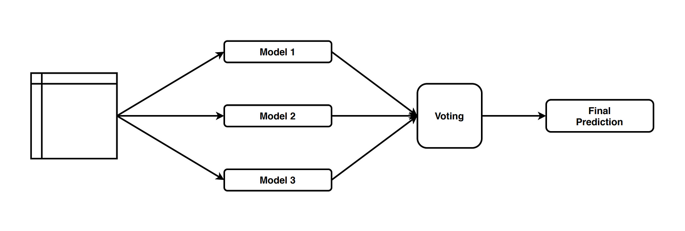

# Day 086 | Voting Ensemble | Part 2 | Classification | Hard vs Soft voting


### Voting Ensemble

**Voting Ensemble** is a simple but effective ensemble learning technique used primarily for classification tasks. It combines the predictions from multiple different models (e.g., decision trees, logistic regression, SVMs) and makes the final prediction based on a **voting strategy**.

There are two main types of voting:

1. **Hard Voting**:

   * Each model casts a "vote" for a class label.
   * The class with the **majority vote** (most common prediction) is selected as the final output.

2. **Soft Voting**:

   * Each model outputs class **probabilities** instead of labels.
   * The probabilities are averaged, and the class with the **highest average probability** is chosen.

Soft voting typically performs better than hard voting if the individual models are well-calibrated.

#### Example (using `scikit-learn`):

> Python
```python
from sklearn.ensemble import VotingClassifier
from sklearn.linear_model import LogisticRegression
from sklearn.tree import DecisionTreeClassifier
from sklearn.svm import SVC

model1 = LogisticRegression()
model2 = DecisionTreeClassifier()
model3 = SVC(probability=True)

voting_clf = VotingClassifier(
    estimators=[('lr', model1), ('dt', model2), ('svm', model3)],
    voting='soft'  # or 'hard'
)
voting_clf.fit(X_train, y_train)
```

Voting ensembles are useful when combining diverse models to benefit from their individual strengths and reduce the risk of overfitting.

---


## Gemini
## Voting Ensemble (Short Documentation)

**Definition:** Combines predictions from multiple trained models to make a final prediction.

**Types:**

* **Hard Voting (Classification):** Final prediction is the majority class vote.
* **Soft Voting (Classification):** Final prediction is the class with the highest average predicted probability.
* **Averaging (Regression):** Final prediction is the average of individual model predictions.

**Implementation:**

1.  Train multiple diverse models.
2.  Define the voting/averaging mechanism.
3.  Aggregate predictions for new data.

**Pros:** Simple, robust, can improve accuracy, leverages diverse models.

**Cons:** Performance depends on base learners, reduced interpretability, requires careful base learner selection.

**Use When:** Multiple good models exist, want robustness/accuracy improvement, simple ensemble needed.


## Images

