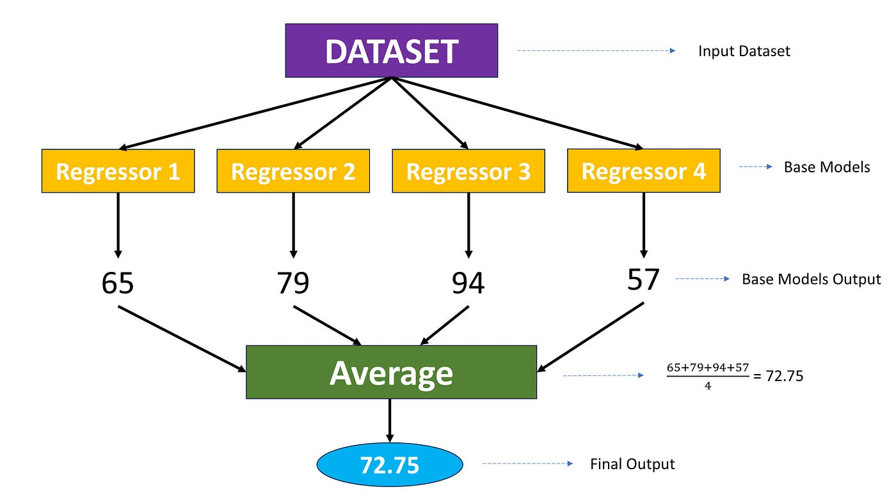

# Day 087 | Voting Ensemble Regressor

Here’s a concise explanation of **Voting Ensemble for Regression** (Voting Regressor) for your machine learning notes:

---

### Voting Ensemble Regressor

A **Voting Regressor** is an ensemble technique used for regression tasks. It combines the predictions of multiple different regression models and outputs the **average** of their predictions. This approach helps reduce variance and improve the overall stability and accuracy of the model.

Unlike classification (which uses hard or soft voting), the regression version simply **averages the numerical outputs** from all base models.

#### Key Characteristics:

* It works best when the base regressors are diverse (e.g., linear models, decision trees, SVR).
* It can reduce the risk of overfitting by balancing out individual model biases.
* It’s easy to implement and interpret.

#### Example (using `scikit-learn`):

```python
from sklearn.ensemble import VotingRegressor
from sklearn.linear_model import LinearRegression
from sklearn.tree import DecisionTreeRegressor
from sklearn.svm import SVR

reg1 = LinearRegression()
reg2 = DecisionTreeRegressor()
reg3 = SVR()

voting_reg = VotingRegressor(estimators=[
    ('lr', reg1), ('dt', reg2), ('svr', reg3)
])

voting_reg.fit(X_train, y_train)
y_pred = voting_reg.predict(X_test)
```

By averaging the predictions of different regressors, the voting regressor can produce more reliable and robust predictions, especially when no single model performs consistently better than the others.

---


## Gemini
## Voting Regressor: Short Documentation

**Definition:** An ensemble learning technique for regression that combines the predictions of multiple individual regression models by averaging their outputs.

**Mechanism:**

1.  Train multiple regression models (can be different types).
2.  For a new data point, each model predicts a numerical value.
3.  The final prediction is the **average** of these individual predictions. Optionally, you can assign weights to each model's prediction before averaging.

**Key Parameters:**

* `estimators`: A list of (name, estimator) tuples, specifying the regression models to include in the ensemble.
* `weights`: An optional list of weights to assign to each model's predictions during averaging. If `None`, all models are weighted equally.

**Pros:**

* Simple and easy to implement.
* Can improve prediction accuracy and robustness compared to single regressors.
* Leverages the strengths of different regression models.
* Reduces the impact of individual model errors.

**Cons:**

* Performance is limited by the quality and diversity of the base regressors.
* Interpretability of the ensemble is generally lower than individual models.
* Requires careful selection of the base regressors.

**Use When:**

* You have multiple well-performing regression models.
* You want to potentially increase prediction accuracy and stability.
* A straightforward ensemble method is desired for regression tasks.

## Images
