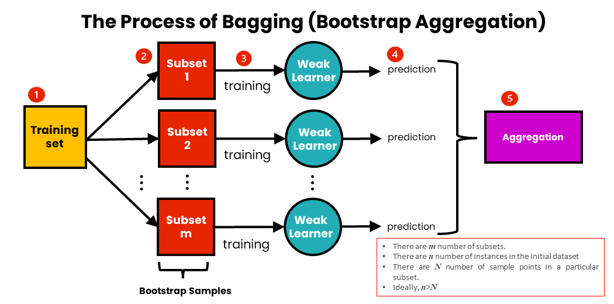

# Day 088 | Bagging | Intution Part

---

### Bagging (Bootstrap Aggregating)

**Bagging**, short for **Bootstrap Aggregating**, is an ensemble learning technique that aims to improve the stability and accuracy of machine learning models by **reducing variance**. It is especially effective for high-variance models like decision trees.

#### How Bagging Works:

1. **Bootstrap Sampling**: Create multiple different training datasets by randomly sampling (with replacement) from the original dataset.
2. **Model Training**: Train a separate model (often of the same type) on each sampled dataset.
3. **Aggregation**:

   * For **classification**, the models vote and the majority class is chosen (hard voting).
   * For **regression**, the predictions are averaged.

Because each model sees a slightly different dataset, they learn slightly different patterns. Combining them reduces overfitting and improves generalization.

#### Example (using `scikit-learn`):

```python
from sklearn.ensemble import BaggingClassifier
from sklearn.tree import DecisionTreeClassifier

bagging_model = BaggingClassifier(
    base_estimator=DecisionTreeClassifier(),
    n_estimators=100,
    bootstrap=True
)

bagging_model.fit(X_train, y_train)
```

#### Key Features:

* Reduces variance (helps prevent overfitting)
* Works best with unstable learners (e.g., decision trees)
* Parallelizable since each model is trained independently

**Random Forest** is a popular extension of bagging that uses decision trees with an added twist: it introduces randomness in feature selection as well.

---


## Gemini

## Bagging (Bootstrap Aggregating): Short Documentation

**Definition:** An ensemble learning technique that aims to improve the stability and accuracy of machine learning algorithms by reducing variance and preventing overfitting. It trains multiple base learners independently on different random subsets of the training data (created with replacement, known as bootstrapping) and then aggregates their predictions.

**Mechanism:**

1.  **Bootstrapping:** Create multiple subsets of the original training data by sampling with replacement. Each subset has the same size as the original data but may contain duplicates and miss some original instances.
2.  **Independent Training:** Train a base learning algorithm (e.g., decision tree, neural network) on each of these bootstrap samples independently.
3.  **Aggregation:** Combine the predictions of all the trained models:
    * **Classification:** Use majority voting (hard voting) to determine the final class label.
    * **Regression:** Average the predictions of all the models.

**Key Parameters (in implementations like scikit-learn):**

* `base_estimator`: The base learning algorithm to be trained on each subset.
* `n_estimators`: The number of base estimators (models) to train.
* `bootstrap`: Whether to use bootstrapping for creating subsets (usually `True`).
* `max_samples`: The number of samples to draw from the original dataset (with replacement) to train each base estimator.
* `bootstrap_features`: Whether to sample features with replacement for each base estimator.
* `max_features`: The number of features to draw from the original dataset to train each base estimator.

**Pros:**

* Reduces variance and helps prevent overfitting, especially for high-variance base learners (like decision trees).
* Improves the stability and robustness of the model.
* Can lead to improved accuracy compared to a single base learner.
* Each base estimator is trained independently, allowing for parallel processing.
* Provides an "out-of-bag" (OOB) error estimate, which can be a useful measure of generalization without needing a separate validation set.

**Cons:**

* Can slightly increase bias in some cases.
* Loss of interpretability compared to a single base learner.
* Can be computationally expensive if the number of estimators is large or the base learner is complex.
* May not significantly improve performance for stable, low-variance base learners (like linear regression).

**Use When:**

* You are using a high-variance base learning algorithm and want to reduce overfitting.
* You want to improve the stability and robustness of your model.
* Computational resources allow for training multiple models.
* You need a relatively simple and effective ensemble technique.

**Examples of Algorithms Using Bagging:**

* **Random Forest:** An ensemble of decision trees where each tree is trained on a bootstrapped sample of the data and a random subset of features.
* **Bagged Decision Trees:** A direct application of the bagging technique with decision trees as the base estimator.

---

## Images


